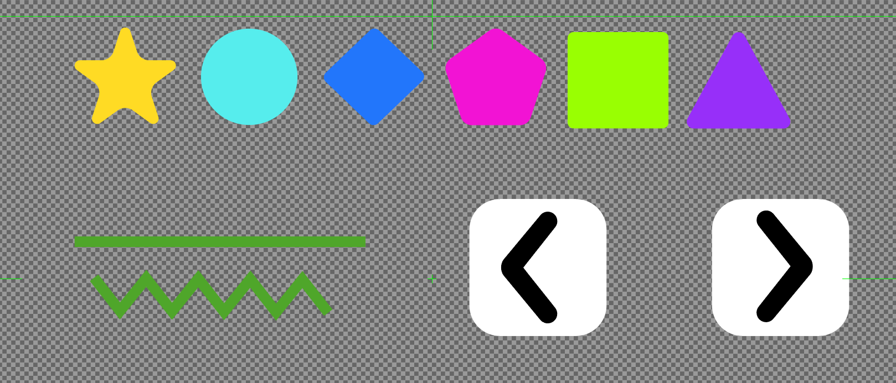
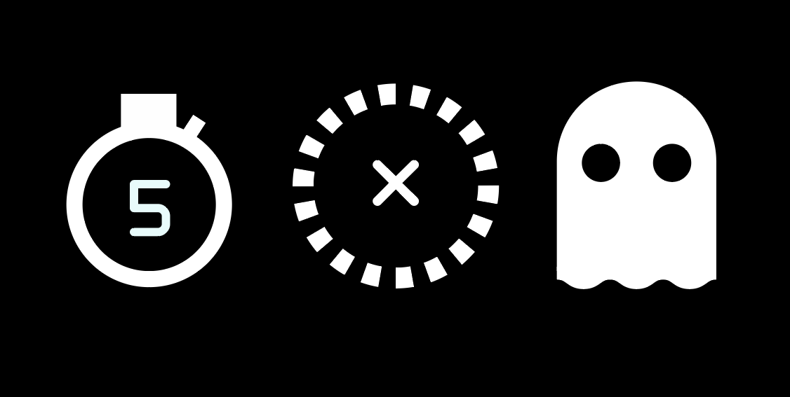
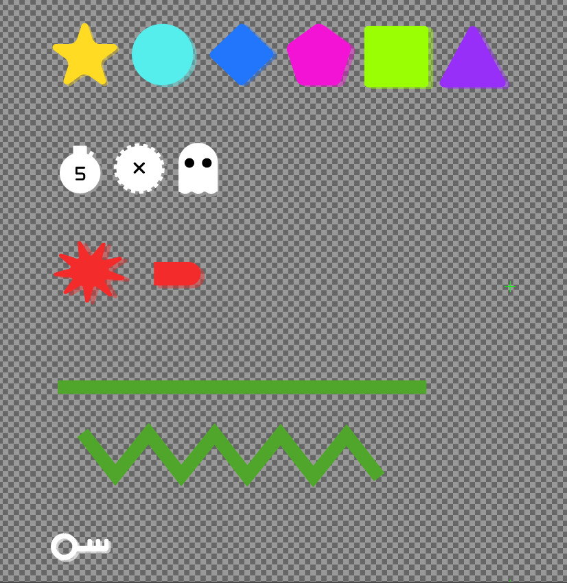
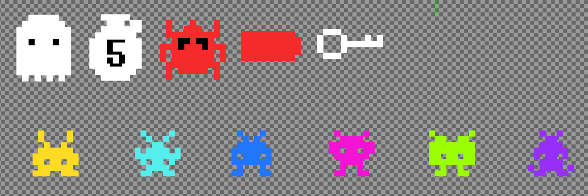
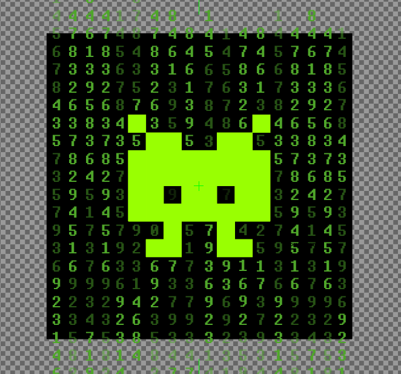
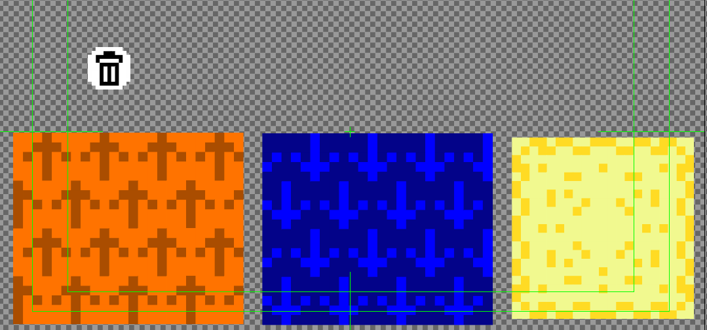
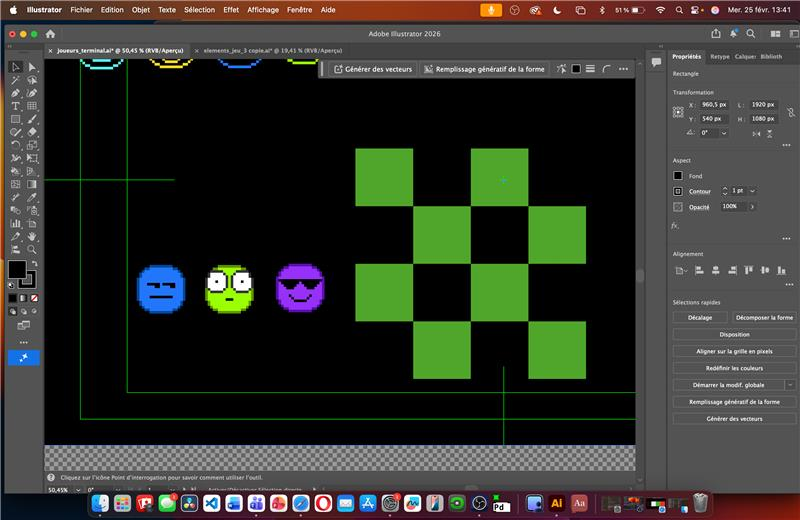
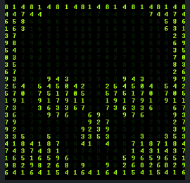
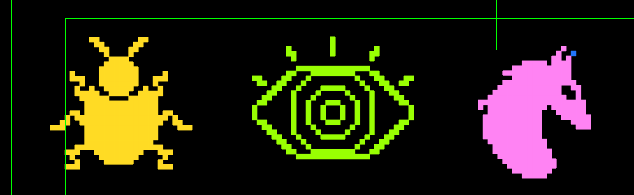
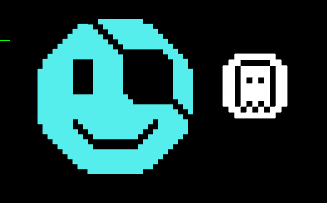

# Dana Saavedra-Torrano

 <!--
À la session 6, 
- Au début de la semaine : 
    - Objectifs de la semaine
- À la fin de la semaine :
    - Explication détaillée des tâches accomplies
    - Documentation multimédia des tâches accomplies
 -->

# Planification

## Semaine 1

- Mise à jour du site web du projet
- Planification personnelle pour les semaines à venir
- Planification des visuels à concevoir pour le jeu

## Semaine 2

- Concevoir le design visuel des boutons directionnels de la manette
- Concevoir le design visuel de chaque joueur (6 joueurs au total)
- Concevoir les designs visuels des murs et des différentes portes du jeu
- Concevoir le design visuel du cadenas pour les zones de sortie bloquées

## Semaine 3

- Concevoir les designs des powers ups (le trail s’efface, on peut passer à travers les murs et le temps s’arrête pendant une durée déterminée)
- Installation des lumières LED dans le grand studio
- Planification de la direction artistique du tutoriel
- Finalisation des designs visuels de la semaine 2

## Semaine 4

- Correction des designs présentés durant la semaine 3
- Début de la création des visuels du tutoriel du jeu
- Création du design visuel du favicon du jeu

## Semaine 5

- Création des niveaux 15 et 16 avec 6 niveaux de difficulté selon le nombre de joueurs (12 scènes)

## Semaine 6

- Création du niveau 17 avec 6 niveaux de difficulté selon le nombre de joueurs (6 scènes)
- Installation des 3 chaises gonflables et des guirlandes lumineuses (fairy lights) dans le grand studio

## Semaine de rattrapage

- Création du début de la cinématique (l’histoire du jeu)
- Finalisation du tutoriel du jeu

## Semaine 7

- Travail sur le montage vidéo de la documentation

## Semaine 8

- Supervision et maintenance des guirlandes lumineuses (fairy lights) et des lumières LED durant la présentation du projet

 

# Journal de bord

## Semaine 2

### Lundi

- Finalisation de la planification

### Mardi

Remise de la planification   
- Conception de l’image (design visuel) du cadenas représentant les zones bloquées à l’aide d’Adobe Illustrator.

### Mercredi

- Conception de l’image (design visuel) des boutons directionnels de la manette,de chaque joueur (6 joueurs au total),des murs et de la porte du jeu à l’aide d’Adobe Illustrator.

### Jeudi

### Vendredi

## Semaine 3

### Lundi

### Mardi

- Conception de l’image (design visuel) des powers ups à l’aide d’Adobe Illustrator.

### Mercredi

- Installation de la maquette dans le grand studio

### Jeudi

Remise maquette 1   
- Correction des images (design visuel) par rapport aux commentaires reçus par le professeur.
- Rajout d'un aspect de profondeur sur tous les visuels.

### Vendredi

## Semaine 4

### Lundi

### Mardi
- Correction des images (design visuel) par rapport aux commentaires reçus par le professeur. 
- Reconception de l'image des joueurs, de 2 power-ups ( passer à travers les murs et arrêter le temps ), les ennemis et la clé.

### Mercredi
- Conception de l'image du favicon et changement de couleur sur le site web du rouge au vert.

### Jeudi
- Conception de l'image (design visuel) du power-up qui efface le tracé du joueur, de la zone de ralentissement, de la zone d'accélération et de la zone victoire.

### Vendredi

## Semaine 5

### Lundi

### Mardi
- Mise à jour du journal de bord en ajoutant les médias du travail fait pour la documentation.

### Mercredi
- Recherche en ligne du matériel nécéssaire pour l'installation pour faire la commande.

### Jeudi
- Tournage de la bande d'annonce dans le grand studio pour montrer l'expéreince du jeu en général.

### Vendredi

## Semaine 6

### Lundi

### Mardi

Remise bande-annonce vidéo - dossier de presse - maquette 2
- Installation des poufs gonflables dans le grand studio pour l'arrivée des étudiants TIM de première année.
- Observation durant la visite des étudiants du déroulement du jeu pour voir les modifications à apporter.

### Mercredi

- Correction des images (design visuel) par rapport aux commentaires reçus par le professeur.
- Reconception des images des 3 joueurs et de la zone victoire.

### Jeudi
- Changement du favicon sur le site web du projet.
- Correction des contraste du logo pour le favicon.

### Vendredi

## Semaine de rattrapge

### Lundi

### Mardi
- Reconception des images de 3 joueurs par rapport aux commentaires reçus par le professeur.

### Mercredi
- Correction de l'image d'un joueur et du power-up fantôme.
- 

### Jeudi

### Vendredi

## Semaine 7

### Lundi

### Mardi

### Mercredi

### Jeudi

### Vendredi
