# Elie Daher

 <!--
À la session 6, 
- Au début de la semaine : 
    - Objectifs de la semaine
- À la fin de la semaine :
    - Explication détaillée des tâches accomplies
    - Documentation multimédia des tâches accomplies
 -->

# Planification

## Semaine 1

- Relecture complète du concept + ajustements selon les commentaires des enseignants
- Ajout de détails au lore + clarification du rôle des opérateurs
- Finalisation du document d’équipe (division des rôles, responsabilités, étapes)
- Vérification du fonctionnement de base du serveur (Routeur + WebSocket + Unity)

## Semaine 2

- Mise en place du serveur WebSocket propre (connexion, déconnexion, attribution des joueurs)
- Ajout du système : “Prêt” -> Décompte -> Début du jeu
- Intégration des commandes "gauche , droite" dans Unity
- Création d’un premier canevas du contrôleur (HTML/CSS simple)
- Début de combination téléphone + jeu Unity pour tester sur niveau 1 (version 1-6 opérateurs, 6 scènes)
- Tests réseau avec 2–3 téléphones pour valider la stabilité des connexions

## Semaine 3

- Stabilisation du contrôleur pour la démo publique (aucune perte de connexion)
- Amélioration du visuel minimal du contrôleur (pour la version démo)
- Feedback visuel des boutons (animation, changement d’état “Prêt”)
- Installation des cables et du projecteur dans le studio pour la démo
- Tests 6 joueurs pour vérifier la stabilité du réseau

## Semaine 4

- Refonte plus propre du code WebSocket (structures, commentaires, simplification)
- Tests pour l’intégration de vibrations/haptique sur mobile (si compatible navigateur)
- Travail sur le responsive du contrôleur pour différents modèles de téléphones
- Ajout des messages d’erreur (perte de connexion, serveur plein, etc.)

## Semaine 5

- Ajout d’un système de reconnexion (si un joueur rafraîchit la page)
- Optimisation du délai réseau (suppression de messages inutiles)
- Début du style final du contrôleur (typographie, transitions, UI plus propre)
- Ajustements du contrôleur selon les nouveaux éléments gameplay de l’équipe Unity

## Semaine 6

- Finalisation visuelle du contrôleur (animations, transitions, icônes)
- Création des niveaux 6, 7, 8 avec 6 difficultés selon le nombre de joueurs (18 scènes)
- Contribution à la vidéo de documentation du projet : captation du processus de développement WebSocket (tests, réseau, configuration routeur), explication des étapes techniques, et fourniture d’extraits montrant l’évolution du contrôleur mobile pour la production finale.

## Semaine de rattrapage

- Création des niveaux 9, 10, 11 avec 6 difficultés selon le nombre de joueurs (18 scènes)
- Ajustements du contrôleur suite aux retours des enseignants et de l’équipe
- Vérification/Correction de bogues réseau en situation réelle (tests avec routeur + studio)
- Améliorations UX sur mobile (taille boutons, anti-zoom, zones mortes dépendant de la taille de l'écran)
- Rédaction d’un guidebook complet et infaillible pour l’installation et l’opération du projet durant la semaine de présentation : étapes pour lancer Unity, configurer l’adresse IP, démarrer le serveur WebSocket, brancher le routeur, générer le code QR, tester un téléphone, et procédures de dépannage. Ce guide permettra à n’importe quel membre (ou personne externe) d’opérer le système seul.

## Semaine 7

- Tests intensifs multi-joueurs (5–6 joueurs simultanés)
- Documentation complète du système WebSocket (diagrammes + explications)
- Ajustements finaux sur la réactivité du contrôleur selon les besoins du gameplay
- Participation à la création de la bande-annonce : captation des séquences de jeu en réseau, enregistrement du fonctionnement du contrôleur mobile, sélection des moments clés et remise du matériel visuel/vidéo à l’équipe de montage.

## Semaine 8

- Maintenance du routeur + serveur WebSocket durant les présentations
- Corrections rapides des bogues réseau à chaud
- Supervision de l’installation (QR codes, connexion téléphones, poste Unity)
- Assistance technique lors des démos publiques

 

# Journal de bord

## Semaine 2

### Lundi

Aucun avancement

### Mardi

- Tentative de configuration du routeur et du système WebSocket pour permettre aux téléphones de se connecter au contrôleur Unity. Plusieurs tests réseau effectués mais toujours pas fonctionnel,problème non résolu pour l’instant.

- J’ai aussi amélioré un peu le contrôleur mobile : ajustements du responsive, ajout du mode paysage forcé, et simplification de l’interface (2 flèches au lieu de 4).

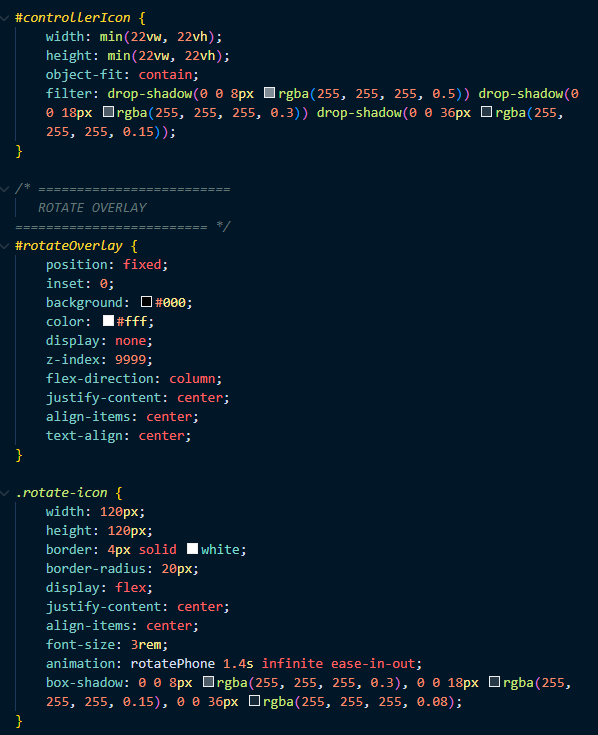

### Mercredi

- J'ai retiré les étapes inutiles et rendre la procédure la plus simple possible. J’ai laissé le serveur et le routeur en fonctionnement 24/7 à l’école pour valider la stabilité (vendredi : vérifier si tout tient ou si de nouveaux bugs apparaissent).

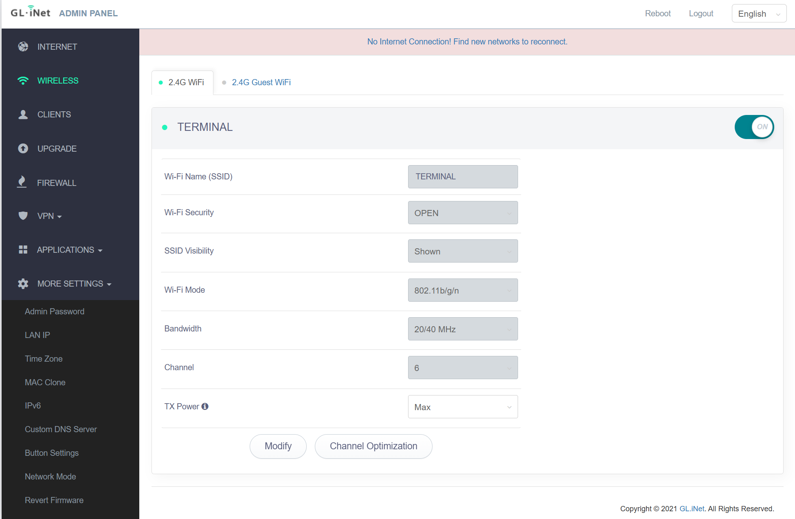

- Journée complète de troubleshooting réseau pour réussir un mode LAN-only stable avec le mini-routeur (téléphones sans internet, accès uniquement au contrôleur).

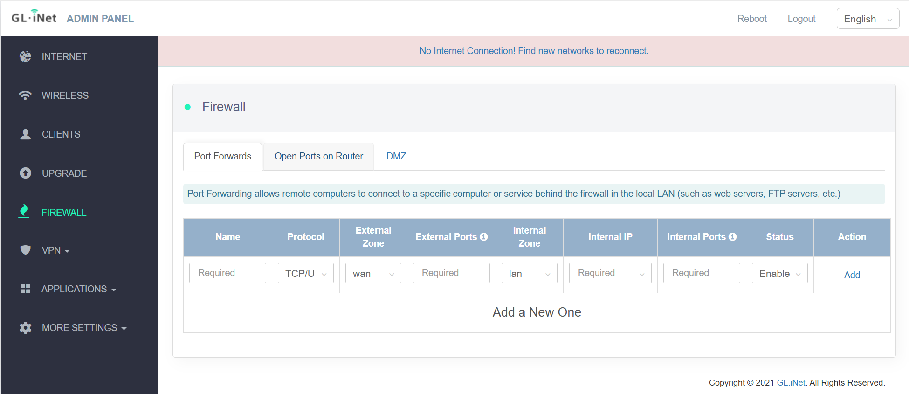

- J’ai identifié un comportement clé : le routeur n’autorise pas correctement le trafic Wi-Fi vers le PC tant qu’il n’a pas “vu” le WAN lors d’un boot/reboot.

Solution trouvée et testée :

- Brancher LAN + WAN, puis faire un reboot dans l’interface du routeur. Ensuite, débrancher le WAN : les téléphones peuvent accéder au serveur Unity/contrôleur.
- Variante : démarrer avec LAN seulement, faire un reboot, puis brancher le WAN 1 à 2 secondes et le retirer. Ça “débloque” l’accès LAN-only.

- Côté contrôleur : amélioration UI vers une version démo minimale avec 2 gros boutons (gauche/droite). Intégration fonctionnelle du flow :

- bouton Pret puis Unity détecte l’état
- décompte avant le début
- gestion des départs : si tous les joueurs quittent ou refresh, Unity affiche dans la console que tous les joueurs ont quitté

### Jeudi

- Setup websocket complet pour faire la connexion des joueurs sur leur téléphone. (Connection, prêt, détection avec Unity serveur)

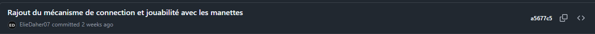

### Vendredi

- Corrections CSS pour éliminer les problèmes de scroll et de centrage sur différents navigateurs (Chrome, Safari).
- Stabilisation du layout final : boutons gauche/droite en plein écran (50 % / 50 %).

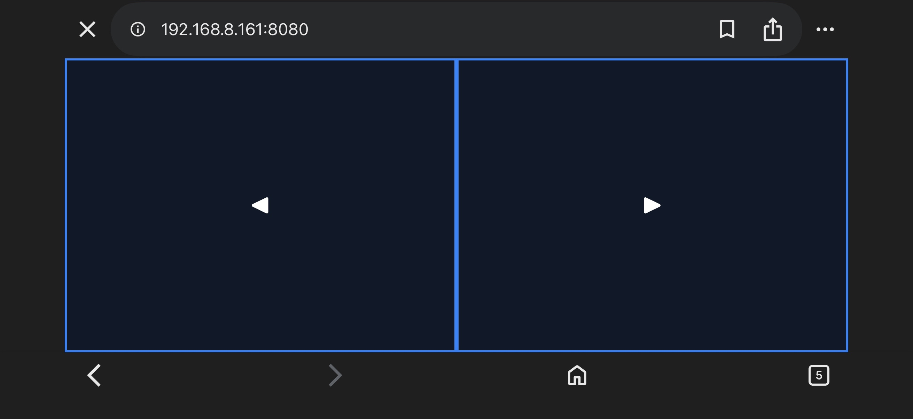

## Semaine 3

### Lundi

- Tests de reprise du système en LAN avec la configuration précédente afin de vérifier que la méthode routeur + serveur Unity fonctionnait toujours.

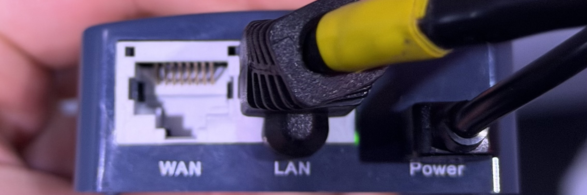

- Tests effectués à la maison afin de vérifier que le système fonctionne toujours dans les mêmes conditions, résultats concluants.

- Configuration de Caddy en "reverse proxy" vers:
- le serveur HTTP Unity (port 8080)
- le serveur WebSocket Unity (port 8750)
- Accès HTTPS configuré via Caddy sur le port 8443

- Adaptation du serveur WebSocket Unity pour accepter correctement les connexions derrière Caddy
- Réussi à avoir accès au contrôleur en `https://` sur PC et téléphones pour que les applications comme Brave peuvent être utiliser.
- La connexion WebSocket a été détectée par Unity avec le HTTPS.

### Mardi

- Débogage de Caddy à l’école afin d’ajouter le HTTPS via un reverse proxy, malgré des contraintes de permissions réseau (port 80).

- Résultat finale de Caddy fait pour qui marche en reverse proxy HTTPS (port 8443) vers :
  - le serveur HTTP Unity (8080)
  - le serveur WebSocket Unity (8750)

- Validation du bon fonctionnement fait :
  - accès au contrôleur en `https://` sur PC et téléphones
  - connexions WebSocket correctement détectées côté Unity
  - communication stable entre les téléphones et le jeu en LAN-only, sans WAN

- Intégration complète des contrôleurs mobiles avec la logique du jeu :
  - gestion dynamique du nombre de joueurs connectés
  - système de prêt / dé-prêt automatique selon les connexions
  - lancement du jeu uniquement lorsque tous les joueurs sont prêts
  - annulation du prêt si un joueur rejoint ou quitte avant le début
  - adaptation automatique du niveau / difficulté selon le nombre de joueurs (ex. carte plus difficile à 2 joueurs, version différente à 6 joueurs)

  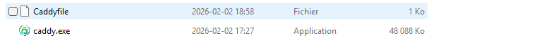
  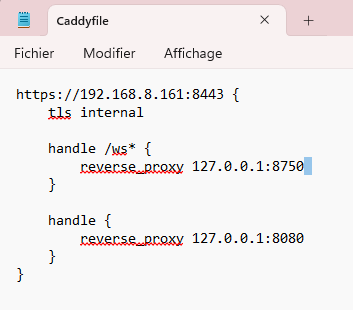
  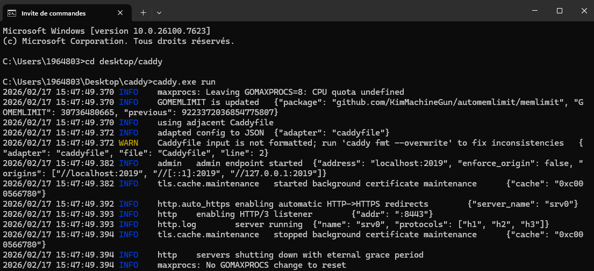

### Mercredi

- Installation et setup des speakers et du projecteur dans le grand studio pour préparer la porte ouverte de jeudi
  
- Déplacement de l'ordi principale qui héberge le serveur Unity à la salle de matrice et configuration avec Caddy et le routeur
  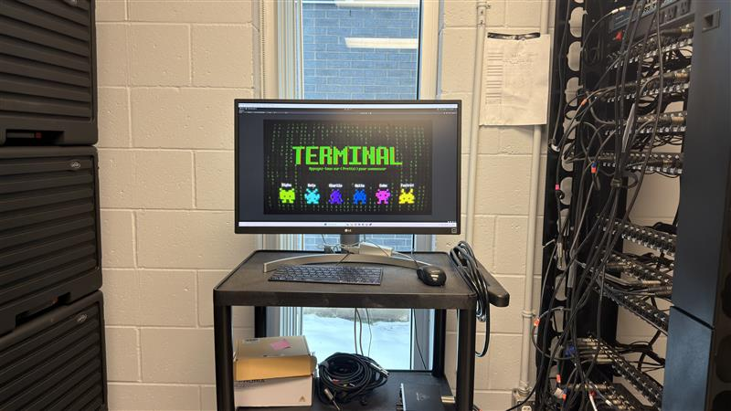

### Jeudi

- Branchement de tous les câbles XLR des speakers jusqu'à la salle de matrice pour configurer l'ordi avec le serveur
  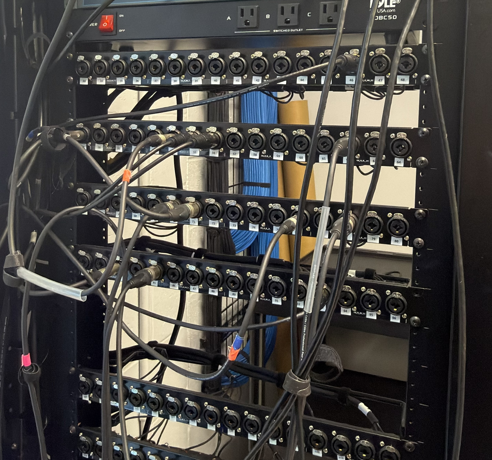

- Accueil des visiteurs de la porte ouverte et explication du programme et de notre projet en démo
- Ajout de CSS au contrôleur pour afficher les formes respectives selon le joueur connecté (pour qu'ils sachent qui ils sont)
  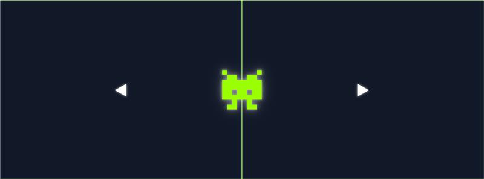

### Vendredi

- Recherche d'inspiration pour le design des opérateurs, de l'ennemi et de l'environnement de la scène
  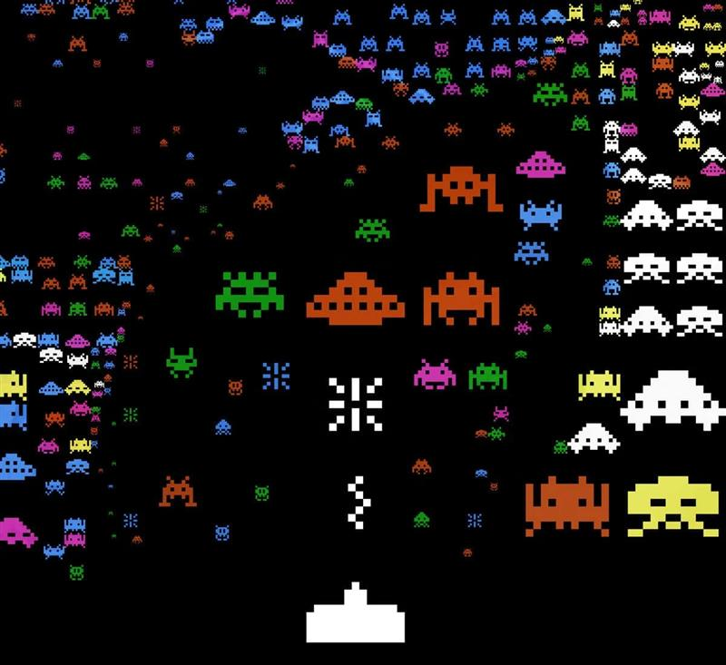

## Semaine 4

### Lundi

- Amélioration CSS du controlleur

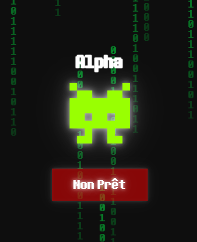

### Mardi

- Installation, alignement et configuration du deuxième projecteur.
  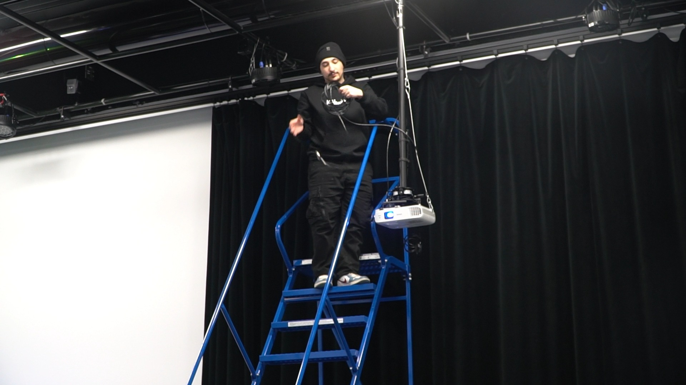
- On a fait en sorte que le "blend" des deux projecteurs est bon avec les corners.
- Ajustement contraste et luminosité des projecteurs.

### Mercredi

- Réinstallation du projecteur avec un support plus petit pour le suspendre au plafond du grand studio (pour réduire les ombres des gens qui passent derrière les joueurs).
  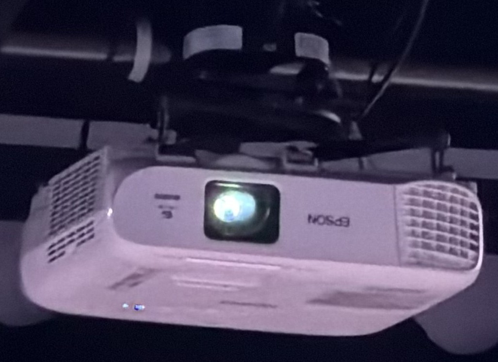
- Alignement physique du projecteur avant de faire les keystone.
- Vérification que les deux haut-parleurs jouent du son et que la gestion des câbles est complète au plafond du grand studio.
- Configuration des lumières pour fonctionner avec HyperHDR pour réagir aux flashs de lumière de l'écran du jeu via l'univers DMX 3
  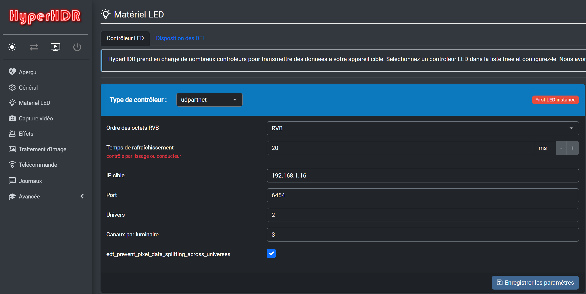

### Jeudi

- Création des sons:
  - **PRÊT:**
    [SFX Ready](ready.wav)
  - **NON PRÊT:**
    [SFX Unready](unready.wav)
  - **CONNEXION:**
    [SFX Connect](connect.wav)
  - **DÉCONNEXION:**
    [SFX Disconnect](disconnect.wav)
  - **3 SONS DIFFÉRENTS POUR 3 POWERUPS DIFFÉRENTS:**
    [SFX PowerupA](powerupA.wav)
    [SFX PowerupB](powerupB.wav)
    [SFX PowerupC](powerupC.wav)
  - **2 VARIATIONS DE SONS DE TIR:**
    [SFX ShootA](shootA.wav)
    [SFX ShootB](shootB.wav)

### Vendredi

- Aucun avancement

## Semaine 5

### Lundi

- Aucun avancement

### Mardi

- Mise à jour du journal de bord avec intégration de tous les médias et sons associés à chaque journée

### Mercredi

- Tournage pour la bande-annonce du projet
- Préparation du dossier de presse
- Premier commit : mise en ligne des liens vers tous les projets des étudiants sur le site 2026 Réseau Vivant
- Recherche pour la commande du podium
- Brainstorm de l'emplacement du podium et les 2 QR Code à mettre

### Jeudi

- Tournage pour la bande-annonce du projet
- Débogage et calibration du projecteur (keystone, alignement physique)
- Réalignement du projecteur pour optimiser la projection

### Vendredi

## Semaine 6

### Lundi

### Mardi

### Mercredi

### Jeudi

### Vendredi

## Semaine de rattrapge

### Lundi

### Mardi

### Mercredi

### Jeudi

### Vendredi

## Semaine 7

### Lundi

### Mardi

### Mercredi

### Jeudi

### Vendredi
