# Émeryk Bélisle

 <!--
À la session 6, 
- Au début de la semaine : 
    - Objectifs de la semaine
- À la fin de la semaine :
    - Explication détaillée des tâches accomplies
    - Documentation multimédia des tâches accomplies
 -->

# Planification

## Semaine 1

- Modification du site web afin de renforcer la direction artistique du projet et d’apporter les changements demandés
- Finalisation de la documentation et de la planification personnelle afin de mieux s’organiser pour les prochaines semaines
- Création du projet Unity TERMINAL

## Semaine 2

- Création du script des opérateurs (ID, couleur, déplacement initial, rotation temporaire sans connexion, traînée créée derrière l’opérateur durant le déplacement)
- Création du préfab des opérateurs avec des variables publiques (ID, direction initiale)
- Création du script Game Manager pour gérer les états du jeu (joueur terminé, tous les joueurs terminés, mort d’un joueur, minuterie de début de partie, lancement du déplacement des opérateurs, redémarrage du niveau en cas d’échec)
- Création du préfab de fin avec des variables publiques afin de faciliter la création des niveaux futurs (nombre de joueurs requis sur une autre fin avant d’en débloquer une nouvelle)
- Création du préfab de mur fixe (mur immobile servant d’obstacle qui détruit les joueurs au contact)
- Création du préfab de mur mobile vertical/horizontal (mur se déplaçant de haut en bas ou de gauche à droite, détruisant les joueurs au contact)
- Création du préfab de mur rotatif (mur tournant sur lui-même et détruisant les joueurs au contact)
- Création du niveau 1 avec un seul joueur afin de vérifier les bogues et les états du jeu

## Semaine 3

- Création du menu principal permettant aux joueurs de voir leur personnage à l’écran après s’être connectés, avant que tous appuient sur prêt
- Création du script permettant le changement de scène vers le niveau suivant lorsque tous les joueurs sont prêts
- Création du niveau 1 avec 6 difficultés selon le nombre de joueurs (6 scènes)
- Préparation de l’ordinateur dans la salle de matrice (installation de Unity, changement d’adresse IP, branchement des câbles pour le grand studio)
- Préparation du code QR afin de permettre aux joueurs de scanner et jouer avec leur téléphone
- Branchement du routeur de l’ordinateur vers le grand studio afin de permettre aux visiteurs de jouer

## Semaine 4

- Ajout de la scène Histoire après que tous les joueurs soient prêts, expliquant le contexte et le but du jeu
- Ajout de la scène Tutoriel après l’histoire, expliquant brièvement les contrôles et le fonctionnement du jeu
- Modification du script de transition des scènes pour suivre le chemin suivant : Menu principal → Histoire → Tutoriel → Niveau 1
- Création du script Porte avec des variables publiques permettant d’associer une clé à une porte (lorsqu’un joueur touche une clé de couleur, la porte correspondante s’ouvre)
- Création du préfab Clé
- Création du préfab Porte

## Semaine 5

- Modification du script Game Manager afin de passer automatiquement au niveau suivant en cas de réussite et d’ajuster la difficulté selon le nombre de joueurs présents
- Création du préfab Zone de ralentissement (ralentit le mouvement du joueur afin de faciliter la réflexion)
- Création du préfab Zone d’accélération (accélère le mouvement du joueur, rendant la réflexion plus difficile)

## Semaine 6

- Création du script Ennemi avec des variables publiques permettant d’ajuster sa vitesse et sa distance de détection
- Création du préfab Ennemi (objet qui suit un opérateur lorsqu’il le détecte; s’il touche la tête, l’opérateur meurt; s’il touche la traînée, l’ennemi meurt)
- Création du script Mur temporaire avec une variable publique pour modifier l’intervalle entre l’état ouvert et fermé
- Création du préfab Mur temporaire (mur alternant entre ouvert et fermé à intervalles réguliers)
- Création du script Projectile avec des variables publiques permettant d’ajuster la taille, la vitesse et la fréquence de tir
- Création du préfab Projectile (objet visant une position fixe et tirant des projectiles qui détruisent les opérateurs au contact de la tête)

## Semaine de rattrapage

- Création du script du power-up Reset Trail
- Création du préfab du power-up Reset Trail (réinitialise complètement la traînée de l’opérateur)
- Création du script du power-up Stop Global avec une variable publique permettant de définir la durée de l’arrêt
- Création du préfab du power-up Stop Global (tous les joueurs s’arrêtent temporairement pour réfléchir)
- Création du script du power-up Stop Opérateur avec une variable publique permettant de définir la durée de l’arrêt
- Création du préfab du power-up Stop Opérateur (seul l’opérateur touché s’arrête temporairement)
- Création du script du power-up Invincibilité avec une variable publique permettant de définir la durée
- Création du préfab du power-up Invincibilité (permet à l’opérateur de traverser les murs sans mourir temporairement)

## Semaine 7

- Création des niveaux 12, 13 et 14 avec 6 difficultés selon le nombre de joueurs (18 scènes)
- Modification du script Game Manager afin que, lorsque les 20 niveaux sont complétés, les joueurs gagnent la partie, voient le texte de fin, puis retournent au menu principal
- Déroulement complet du jeu : Menu principal → Histoire → Tutoriel → Niveaux 1 à 20 → Fin → Menu principal
- En cas de réinitialisation en cours de partie : Menu principal → Histoire → Tutoriel → Niveaux 1 à X → Menu principal
- Débogage final de l’ensemble du jeu afin de tester tous les niveaux et fonctionnalités
- Ajout d’antennes et de faux routeurs sur le podium afin de renforcer la direction artistique du projet

## Semaine 8

- Surveillance et maintenance de Unity durant les présentations afin de corriger rapidement tout problème éventuel
- Surveillance et maintenance du routeur durant les présentations afin de corriger rapidement tout problème éventuel

 

# Journal de bord

## Semaine 2

### Lundi

- Création du Github Terminal-Unity
- Création du Jeu initial Unity
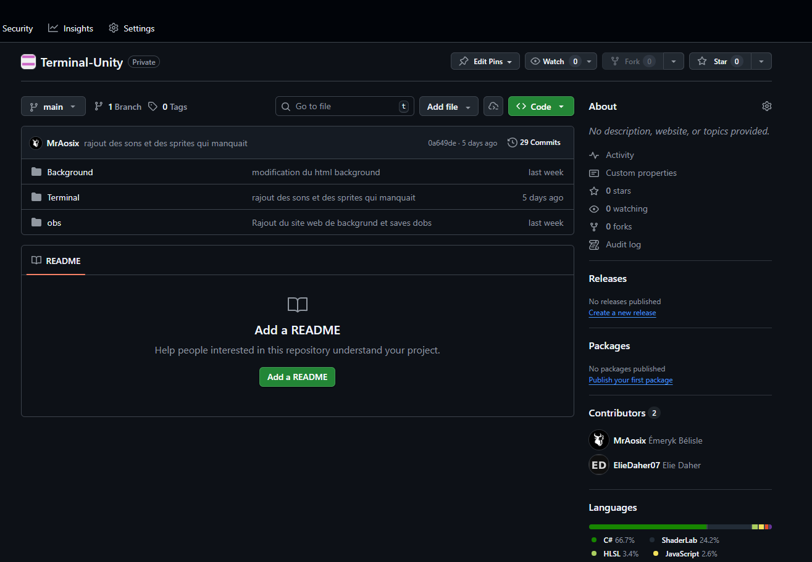

### Mardi

- Tentatives de faire fonctionner le router avec nos téléphones pour pouvoir accès a notre jeu, sans avoir une connection internet
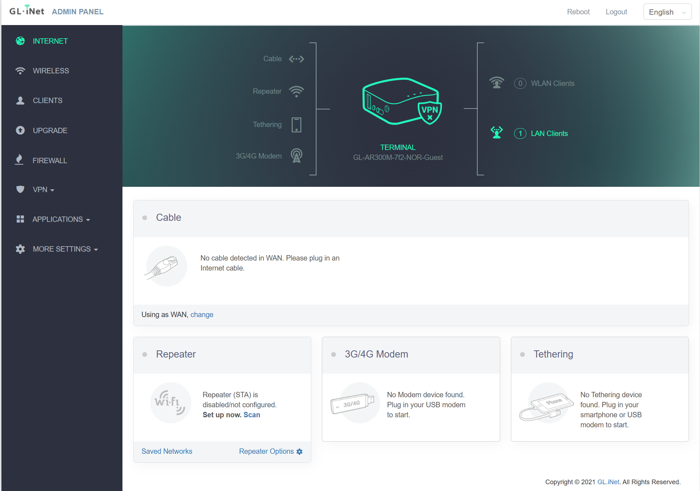
- J'ai trouvé une façon de le faire relativement simple, mais qui fonctionne pas toujours, à trouver comment le rendre fiable
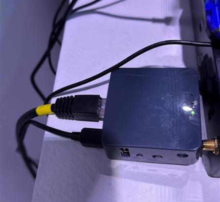

### Mercredi

- Création des premiers dossiers pour bien mettre nos éléments dans le futur
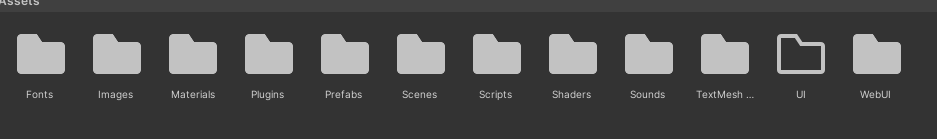
- Création du script Opérateur (joueur) avec tout les données publiques qui sert à l'utilisation et le futur controle avec les manettes téléphones
- Dans le même script, les trails sont créer pendant que ceux-ci bouge et deviennent des obstacles
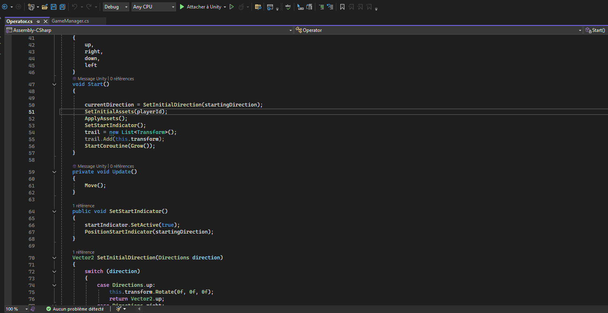
- Création du préfab de l'opérateur pour qu'on puisse modifier le positionnement des opérateur à notre guise et modifier ses valeurs
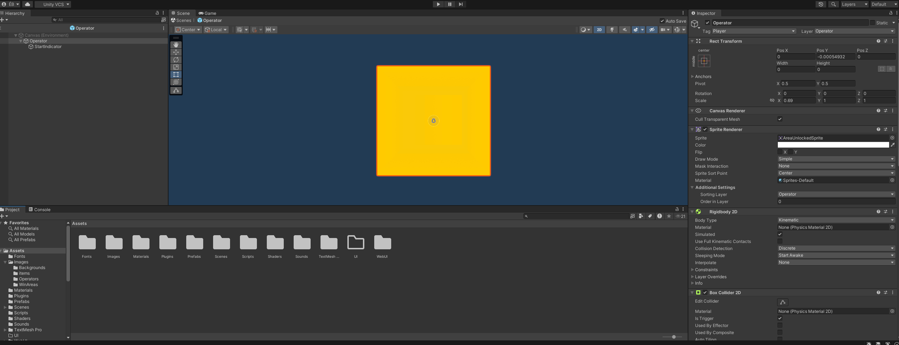
- Commencement du script Game Manager, qui sert pour savoir quand les joueurs finissent le niveau

### Jeudi

- Finalisation du script Game manager qui permet de faire perdre ou gagner les joueurs dépendant du déroulement du jeu
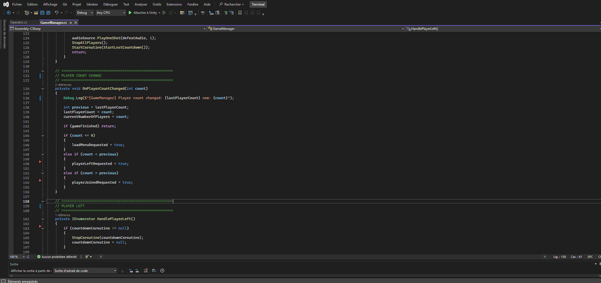
- Création du script de Zone de fin, qui sert à savoir quand les joueurs finissent le niveau
- Création du préfab de la zone de fin, qui nous permet publiquement de changer sa position, grosseur et si il commence verouillé, si il va se vérouiller, et combien de personne qui a besoin avant de changer ses valeurs
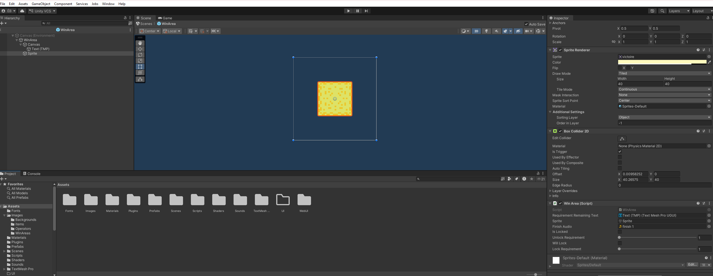
- Création de 3 murs, mur fix, mur qui bouge, et mur qui tourne, le mur qui bouge, permet de choisir sa direction et vitesse, pareil pour lui qui tourne. On peux changer la grosseur et emplacement à notre guise
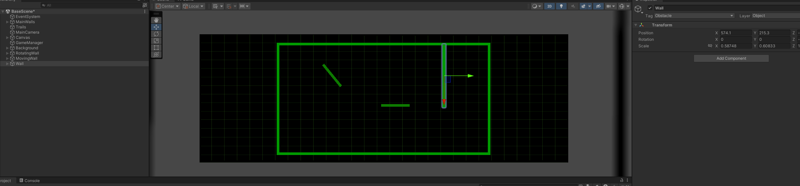

### Vendredi

- Rien de rajouté

## Semaine 3

### Lundi

- Création du menu principal:
  - Ajout automatique d’un joueur à l’écran lorsqu’un joueur rejoint
  - Retrait du joueur de l’écran lorsqu’un joueur quitte
  - Texte du joueur (ex. Joueur 1) en vert lorsqu’il est prêt ou texte en rouge lorsqu’il n’est pas prêt
  - Lorsque tous les joueurs sont prêts: Démarrage d’un countdown + Transition vers la scène Histoire
  - Si un joueur rejoint ou quitte pendant le countdown: Tous les joueurs sont automatiquement remis en non prêt
  
  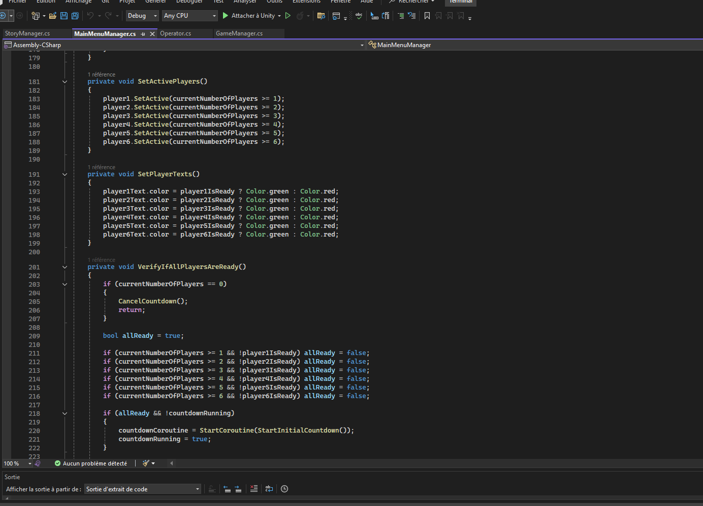

- Création de la scène Histoire:
  - Texte narratif qui change dynamiquement + Transition automatique vers le niveau 1 dépendant du nombre de joueurs (Level1P2, Level1P5, etc.)
  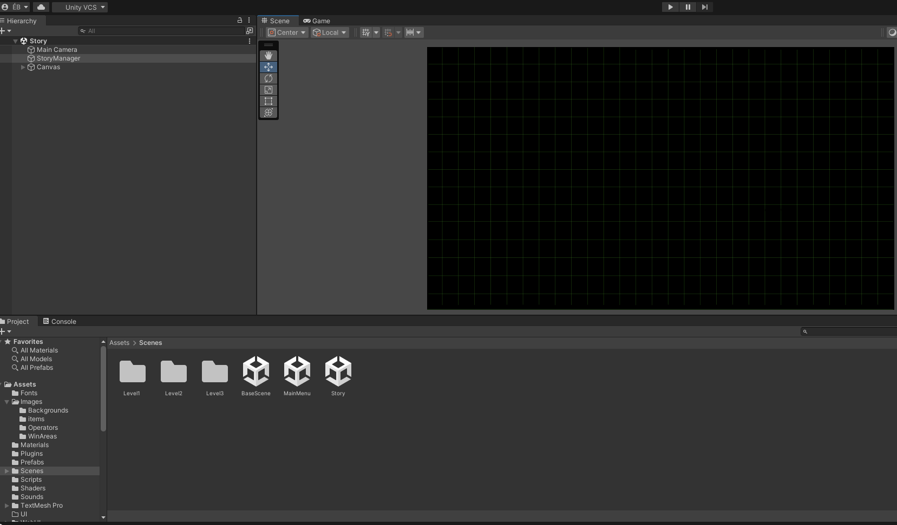
  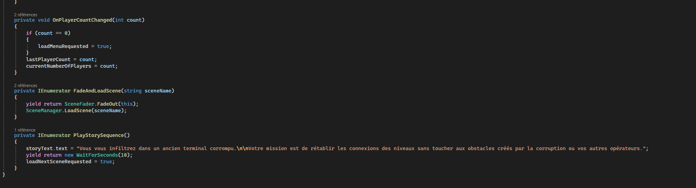

- Gestion des niveaux:
  - Si un joueur meurt: Le niveau recommence
  - Si le ou les joueurs gagnent: Passage au niveau suivant selon le nombre de joueurs actifs
  - Si un joueur rejoint ou quitte pendant un niveau: Affichage d’un message + Rechargement automatique du niveau correspondant au nouveau nombre de joueurs (Level1P4 → Level1P3 ou Level1P5)
  - Si tous les joueurs quittent pendant un niveau: Affichage du même message + Retour automatique au menu principal

### Mardi

- Mettre ensemble les scripts du jeu avec les scripts de Élie pour qu'on puisse contrôler le jeu avec nos téléphones
- Tests complet du système pour trouver des problèmes
- Nous avons eux des problèmes de connections, donc on à du utiliser caddy avec un faux certificat pour être sur https et faire les connections

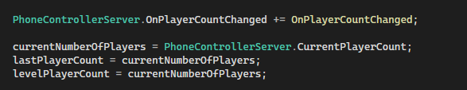
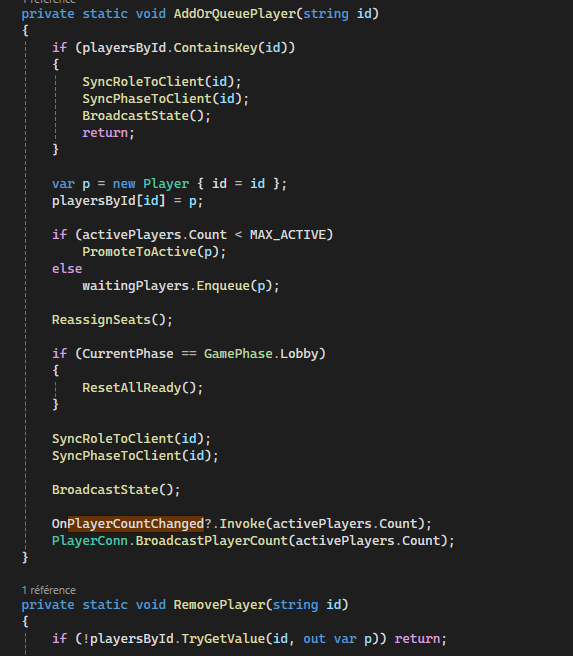
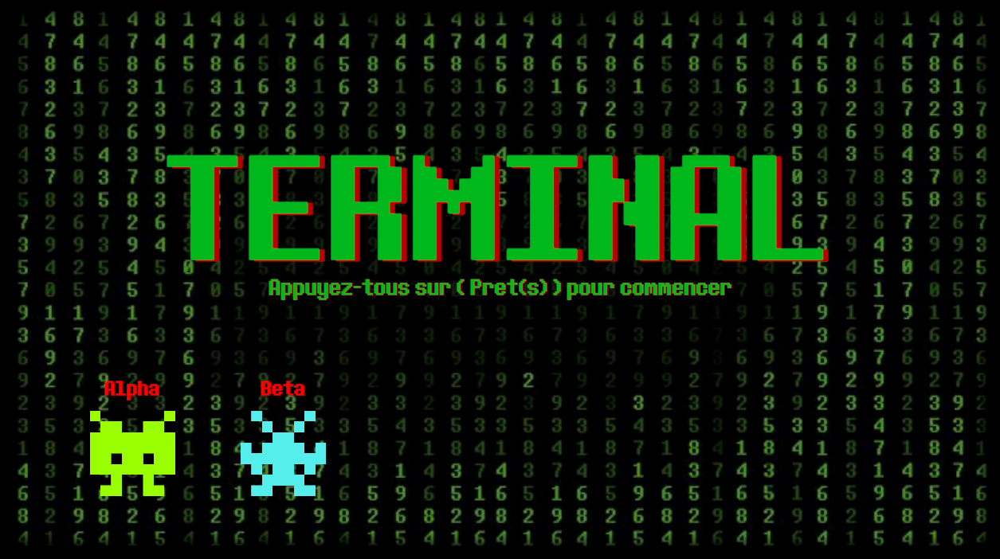

### Mercredi

- Création du niveau 1 avec les 6 difficultés
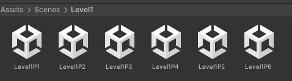
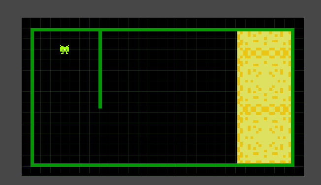
- Rajout des sons présentement créés et placé au bon endroits dans les scripts

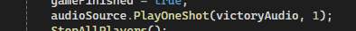
- Rajout des éléments visuels créés et placé dans les préfabs et dans les éléments du UI
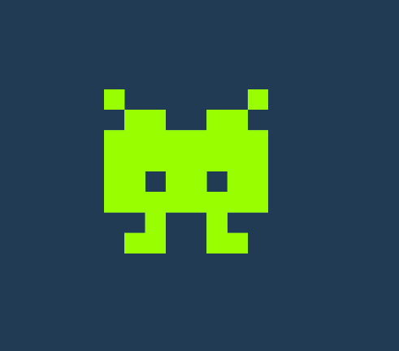
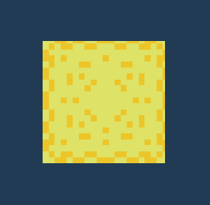
- Placement de l'ordinateur dans la salle de matrice et connection ethernet vers le grand studio

### Jeudi

- Placement du podium temporaire avec le router et les éléments artistiques pour la journée des portes ouvertes
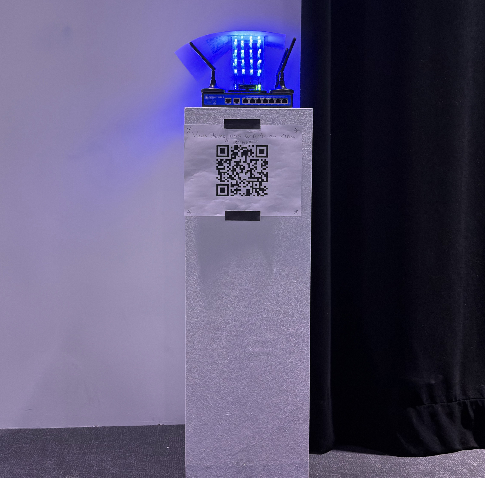

- Débugage et correction des textes avant et pendant la visite
- On a compris asser rapidement que la connection au jeu est présentement trop longue et complexe pour les personnes qui visitent
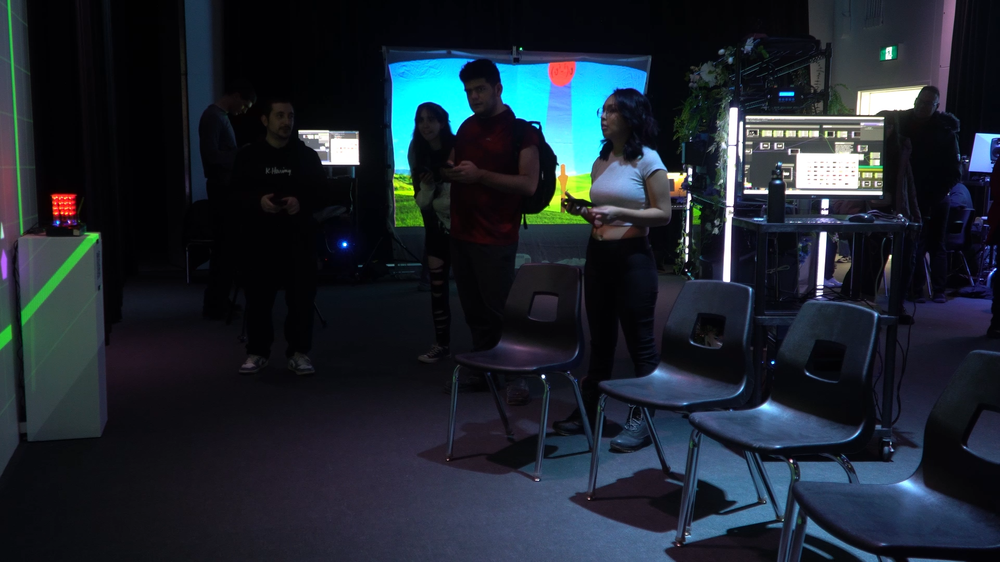

### Vendredi

- Changement complet de la connection vers le jeu avec NGrok, qui sert de passage entre un réseau extérieur vers un réseau local, se qui permet aux personnes avec leur LTE/5G de pouvoir jouer au jeu seulement en scannant le code qr et sans se connecter à notre routeur
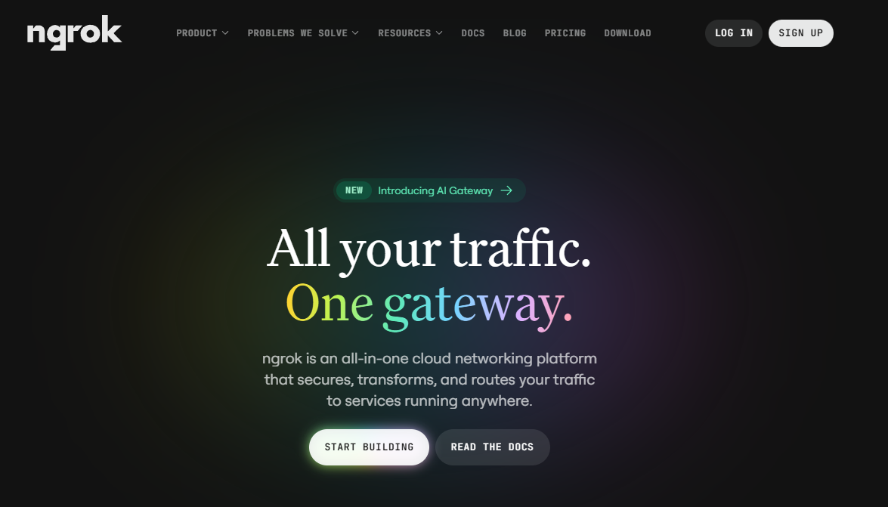
- Vérification si les personnes avec LTE et ceux qui doivent quand même se connecter avec le routeur, effectivement, les 2 peuvent intéragit et jouer en même temps
- Correction du bug trouvé jeudi que quand une personne quitte/rejoint durant le moment de fin du jeu, que cela ne change pas le niveau comme il faut.
- Rajout de 5 effets sur la caméra (Bloom, vhs, glitch, flash, win effect), qui rend le jeu plus dans le style qu'on désire (vieux jeu rétro sur un écran VHS)
- Rajout des transitions fade in et fade out entre les scènes et quand les personnes quittes, joins, gagnent, ou perdent.
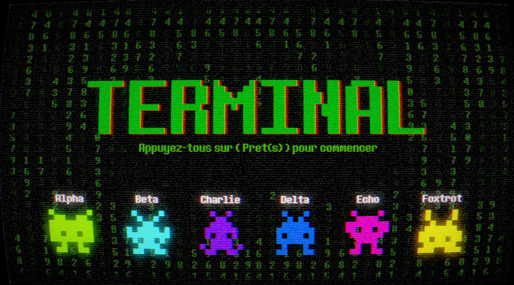
- Supression de caddy et seulement mis sur le port 8080 au lieu de redirect 8443 vers 8080
- Acheter ngrok pour 1 mois (éventuellement 2) pour permettre d'augmenter la limite de connections mensuel et enlever la page entre la connection et le jeu
- Changer le ui du téléphone pour la couleur du joueur que la personne joue et aussi mettre sa forme sur l'écran pour qu'il puisse voir qui il est durant la partie
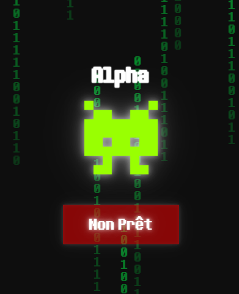
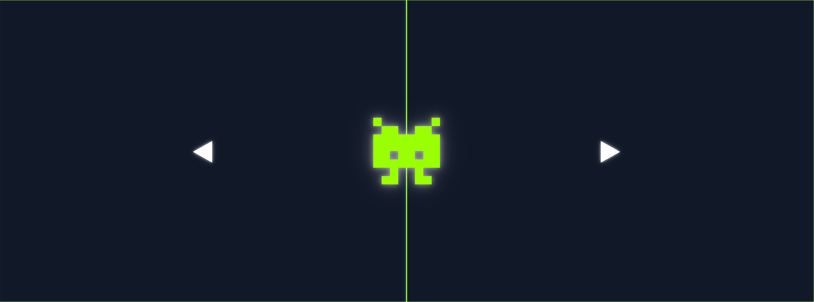
- Garder la flèche de direction durant le jeu au lieu de l'enlever après le countdown initial, se qui permet de mieux savoir comment tourner son personnage.

## Semaine 4

### Lundi
- Rien de rajouté

### Mardi
- Création du background (site web) qui sera éventuellement projeté sur le projecteur background
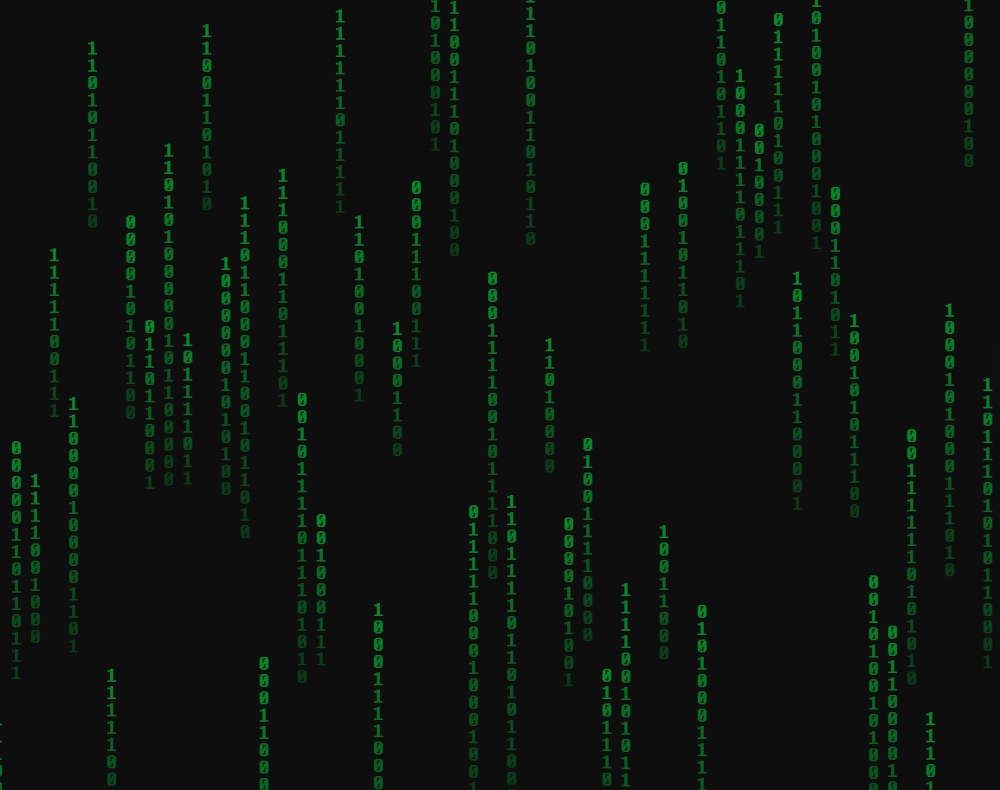
- Création du OBS pour projeter le jeu et le background en même temps
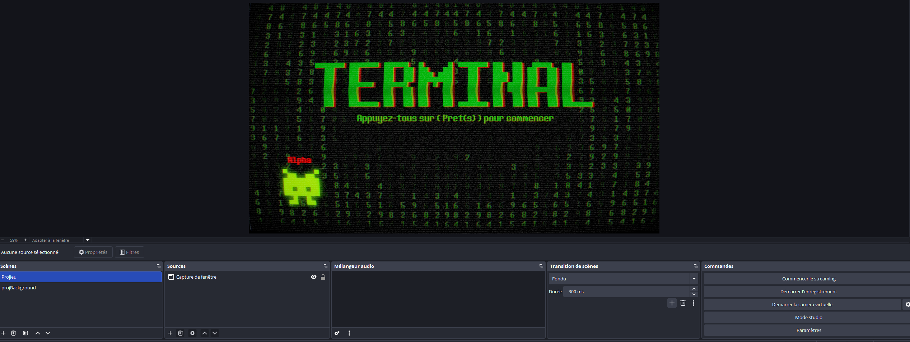
- Rajout de l'effet de 0 et 1 qui monte sur le téléphone des joueurs durant les menus
- Correction des bogues reliés aux téléphones (pas changer de joueur quand 1 quitte par exemple)

### Mercredi
- Installation et placement du projecteur du jeu pour un projecteur plus haut (pour qu'on puisse pas voir nos tête sur la projection)
- Modification de la projection OBS pour mettre le background visible sur l'écran pour les effets des 1 et 0
- Création des niveaux 2 avec 6 difficultés
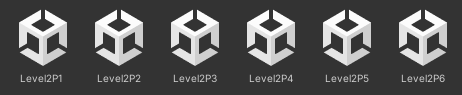
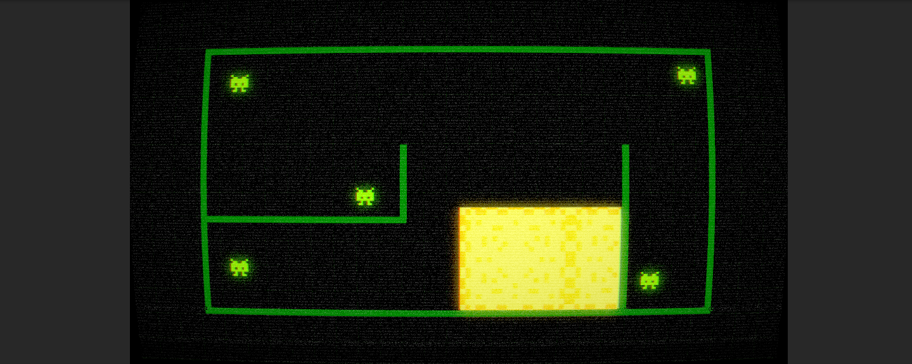
- Changer les paramètres des 2 projecteurs pour mieux diffuser le background et mieux voir le jeu

### Jeudi
- Création des portes et des clés (qui ouvre les portes)
- Création des zones de ralentissement et d'accélération
- Création des ennemis qui tirs et de son projectile
- Création des power ups de freeze, invisibilité et suppression de ligne
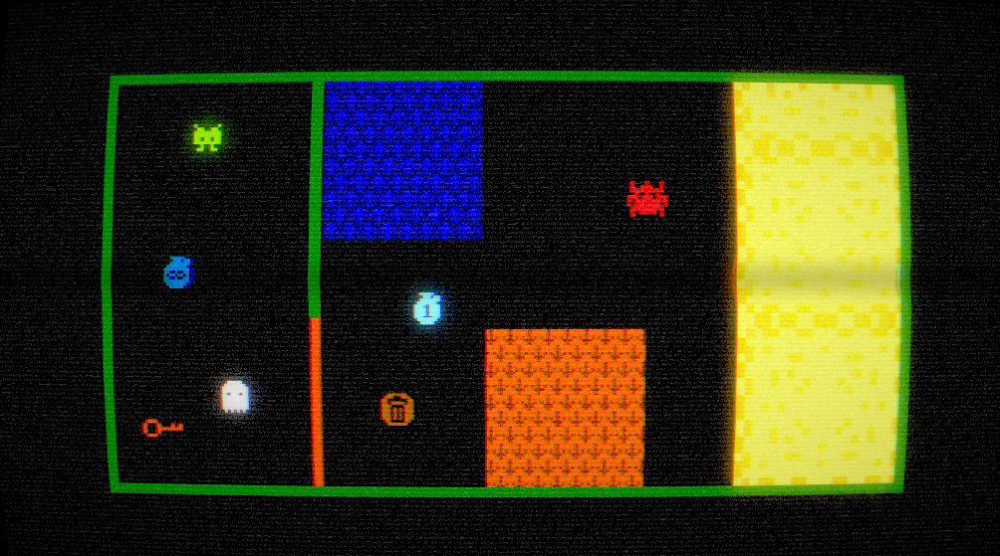
- Changement des sprites pour la majorité des éléments pour ceux-ci permanent
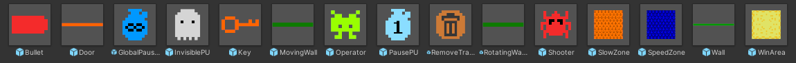
- Changement des images pour les personnages sur les téléphones

- Rajout de tous les sons du jeu (sauf le déplacement des joueurs qui n'ai pas fini)

### Vendredi
- Rien de rajouté

## Semaine 5

### Lundi
- Rien de rajouté

### Mardi

- Rajout des images dans la documentation du journal
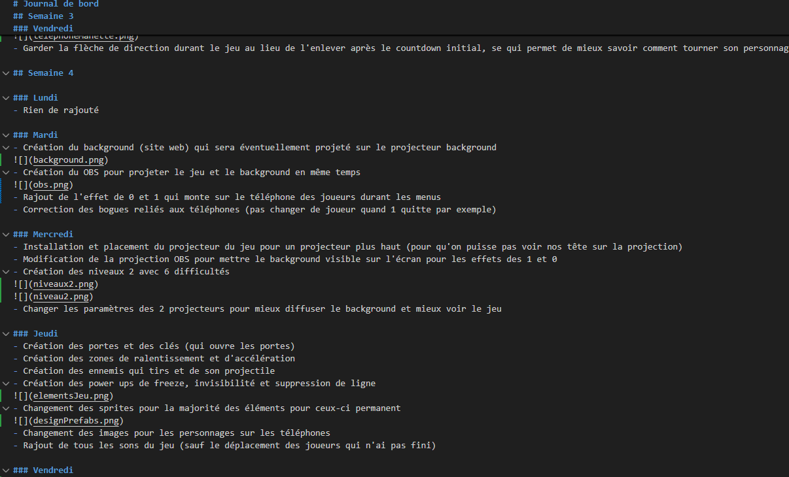

- Prise vidéo pour la bande annonces (Vidéo de la connection des téléphones, écran du jeu pendant qu'ont jouent et nos réactions quand on perd ou gagnent)

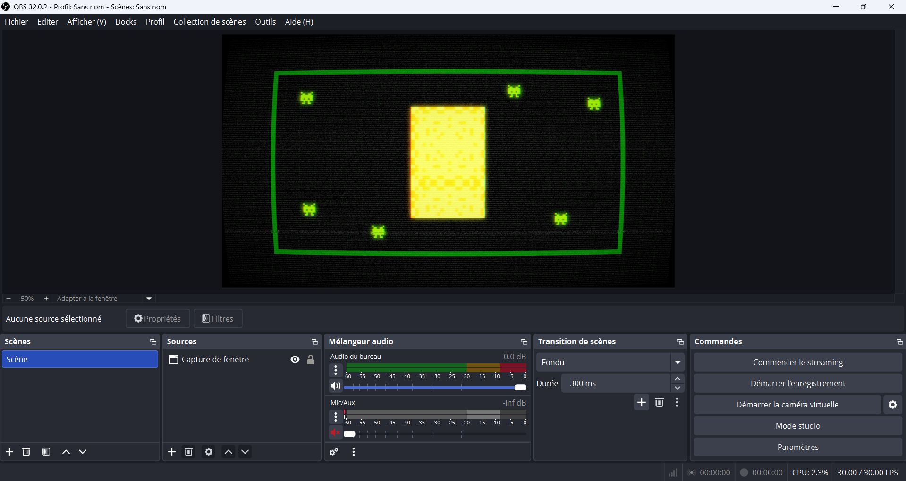
- Rajout du dernier son qui manquait pour le déplacement des joueurs
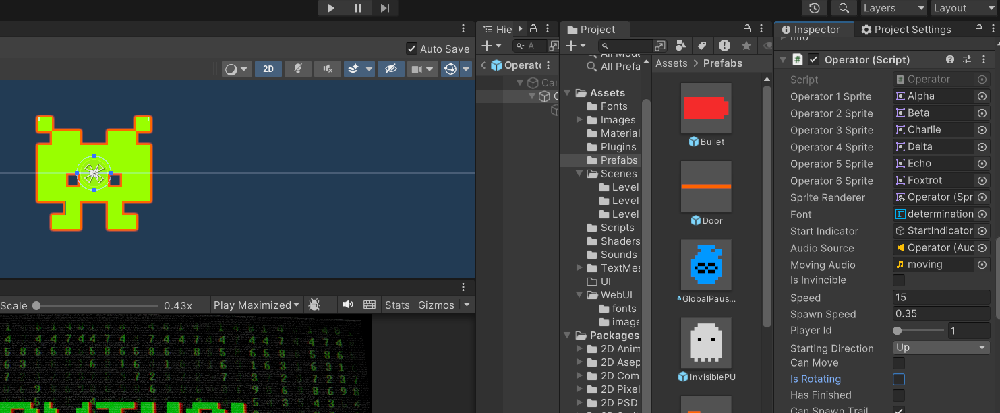

### Mercredi

### Jeudi

### Vendredi

## Semaine 6

### Lundi

### Mardi

### Mercredi

### Jeudi

### Vendredi

## Semaine de rattrapge

### Lundi

### Mardi

### Mercredi

### Jeudi

### Vendredi

## Semaine 7

### Lundi

### Mardi

### Mercredi

### Jeudi

### Vendredi
