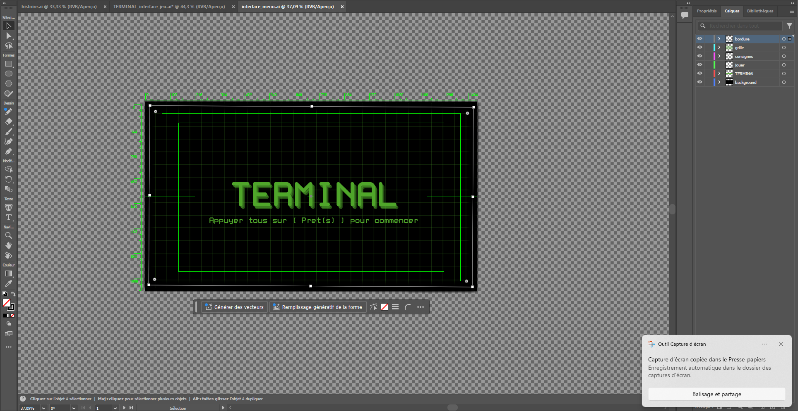
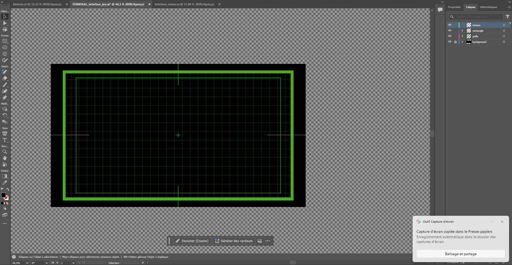
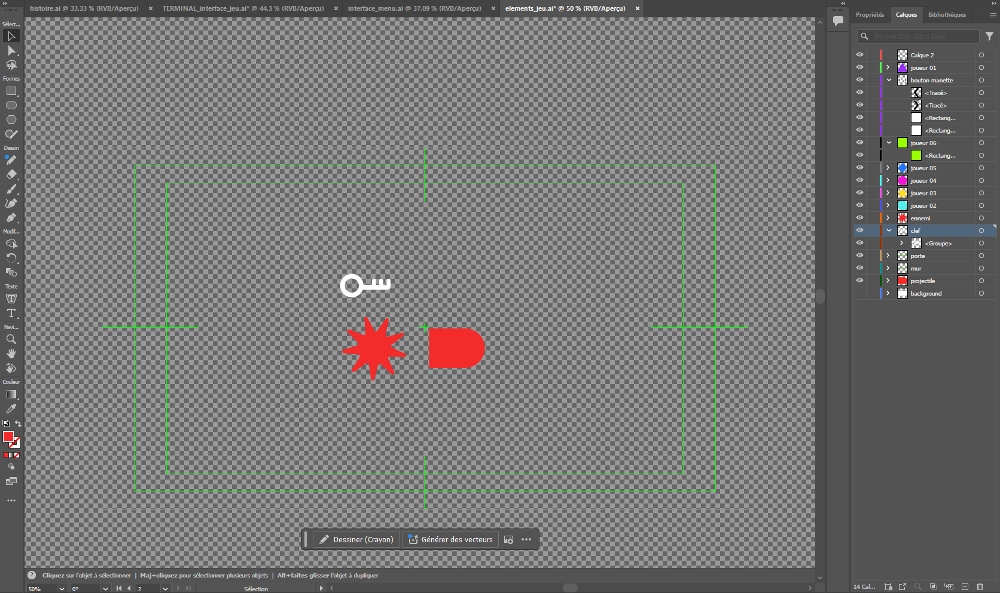
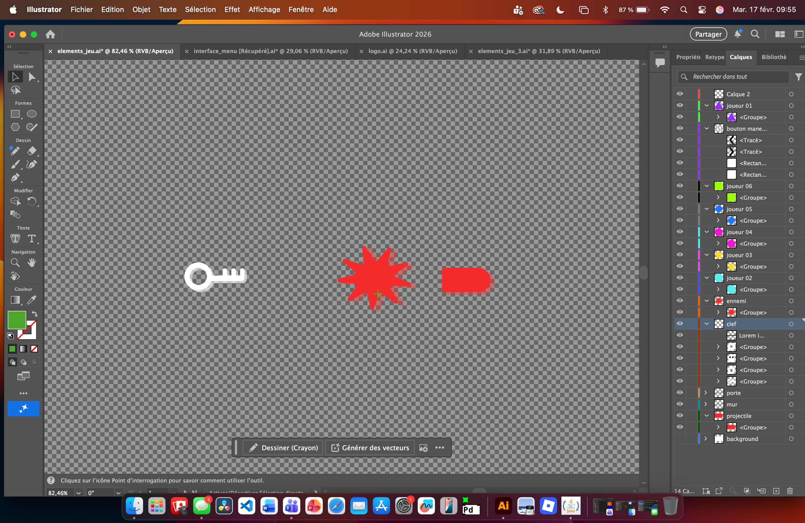
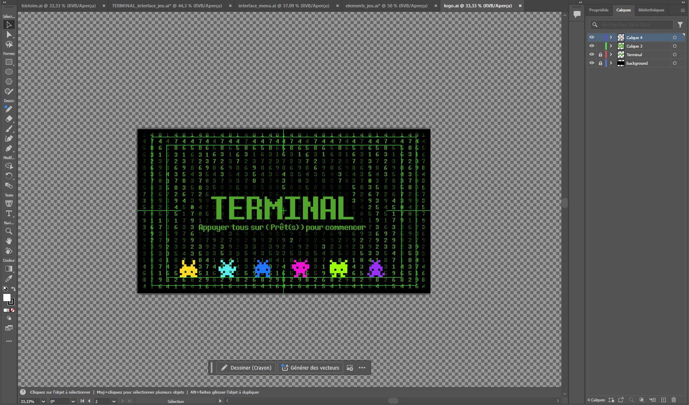
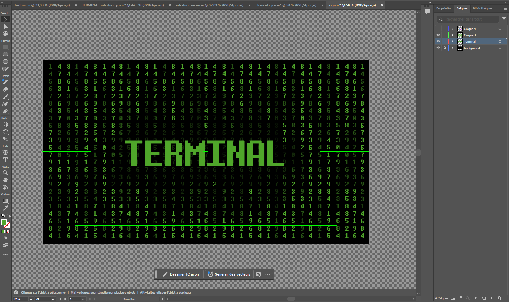
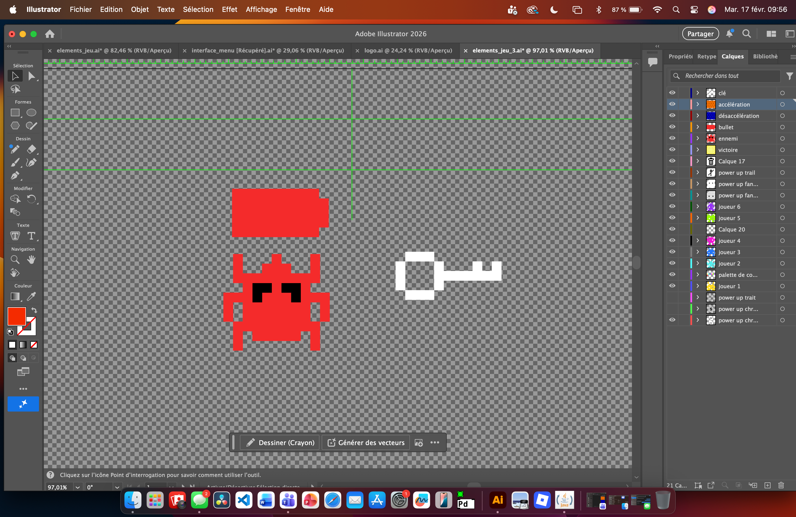

# Mégane Ranger

 <!--
À la session 6, 
- Au début de la semaine : 
    - Objectifs de la semaine
- À la fin de la semaine :
    - Explication détaillée des tâches accomplies
    - Documentation multimédia des tâches accomplies
 -->

# Planification

## Semaine 1

- Mettre à jour le site web du projet.
- Planifier les designs à concevoir.
- Diviser les tâches du projet en équipe.

## Semaine 2

- Travailler sur l’interface du jeu : changer les couleurs pour la nouvelle palette et modifier l’interface du jeu sur illustrator.
- Création d'image des ennemis sur illustrator.
- Création des images visuels des clés sur illustrator.
- Création des images des projectiles sur illustrator.

## Semaine 3

- Travailler sur le menu principal : changer les couleurs de l’ancien modèle pour la nouvelle palette et améliorer le menu si nécessaire.
- Finalisation de tous les visuels.
- Commencer la direction artistique du logo.
- Création du storyboard de l’histoire.
- Installation du spotlight et installation du projecteur.
- Remise Maquette 01 – Jeudi 5 février.

## Semaine 4

- Correction et amélioration des éléments visuels.
- Création du design visuel pour l’histoire.
- Commencer la création du logo.

## Semaine 5

- Créer les 12 difficultés des niveaux 18 et 19 du jeu sur Unity.

## Semaine 6

- Créer les 6 difficultés du niveau 20 du jeu sur Unity.
- Faire une dernière inspection de tous les niveaux pour s’assurer qu’il n’y a pas de bugs.
- Installation du spotlight et des 3 chaises gonflables.

## Semaine de rattrapage

- Création de la deuxième partie de la cinématique.

## Semaine 7

- Création du montage vidéo de la bande-annonce.
- Ajout des visuels au montage vidéo de la bande-annonce.

## Semaine 8

- Présentation finale.
- Supervision de l’installation.
- Gérer le spotlight et le projecteur en cas de problème pouvant survenir lors de la présentation.

 

# Journal de bord

## Semaine 2

- Remise de la planification - Mardi le 27 janvier

### Lundi

- Terminer la planification de la session.

### Mardi

- Les modifications de l'interface du jeu sur illustrator est terminé.
- Les modifications de couleurs, typo et backgound de l'interface menu est complété.

### Mercredi

- Création d'image des ennemis sur illustrator terminé.
- Création des images visuels des clés sur illustrator terminé.
- Création des images des projectiles sur illustrator terminé.

### Jeudi

- Congé

### Vendredi

- Congé

## Semaine 3

- Remise Maquette 01 - Jeudi le 5 février

### Lundi

- Congé

### Mardi

- Journal de bord mis à jour.
- Trouver une nouvelle typographie avec des accents, car la typographique que nous avons présentement ne correspond pas à notre esthétique et n'offre pas les accents. 
- Finalisation du menu principal sur illustrator.

### Mercredi

- Installation dans le grand Studio.

### Jeudi

- Commencer la direction artistique du logo
- Modification des ennemis et de la clef.

### Vendredi

- Congé

## Semaine 4

### Lundi

- Congé

### Mardi

- Journal de bord mis à jour.
- Modification apporté au menu principal.
- Création du design visuel du logo "Terminal".
- Modification du site web de notre équipe pour ajouter le logo.
- Tournage de la documentation.

### Mercredi

- Modification et correction du power-up "chronomètre".
- Modifications des ennemis et de la clef.
- Brainstorm pour la création visuel du background de l'histoire.

### Jeudi

- Commencer la création visuel de l'histoire. À finaliser à la semaine 5.

### Vendredi

- Congé

## Semaine 5

### Lundi

- Congé

### Mardi

- Journal de bord mis à jour. 
- Ajout des médias pour la documentation du projet dans le journal de bord.
- Finalisation de la création visuel du background de l'histoire.

### Mercredi

### Jeudi

### Vendredi

## Semaine 6

- Remise Maquette 02 - Mardi 24 février

### Lundi

### Mardi

### Mercredi

### Jeudi

### Vendredi

## Semaine de rattrapge

### Lundi

### Mardi

### Mercredi

### Jeudi

### Vendredi

## Semaine 7

### Lundi

### Mardi

### Mercredi

### Jeudi

### Vendredi

## Semaine 8

- Remise Final - Vendredi 20 Mars

### Lundi

### Mardi

### Mercredi

### Jeudi

### Vendredi
