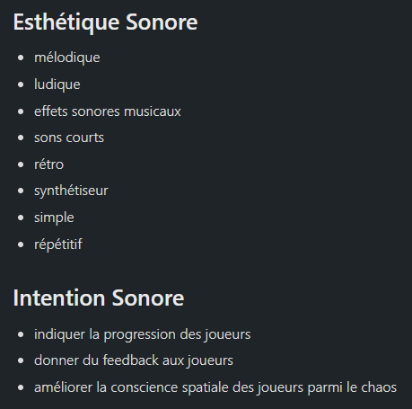
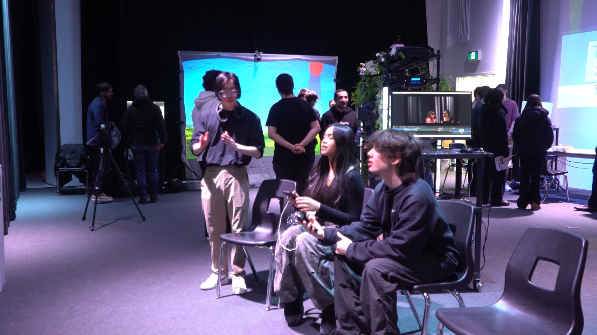
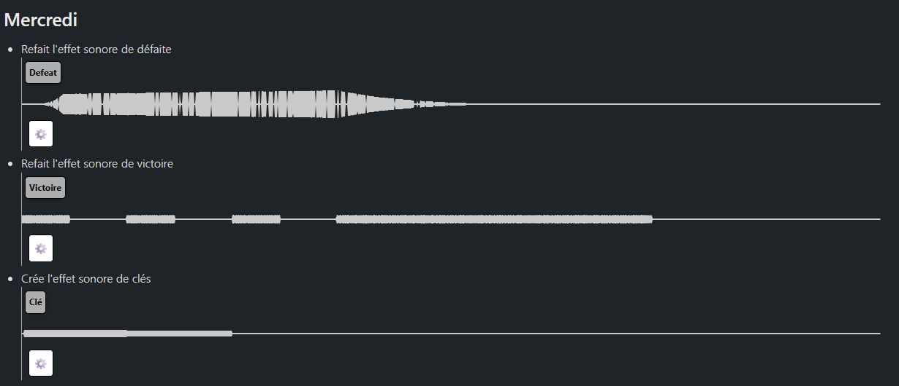
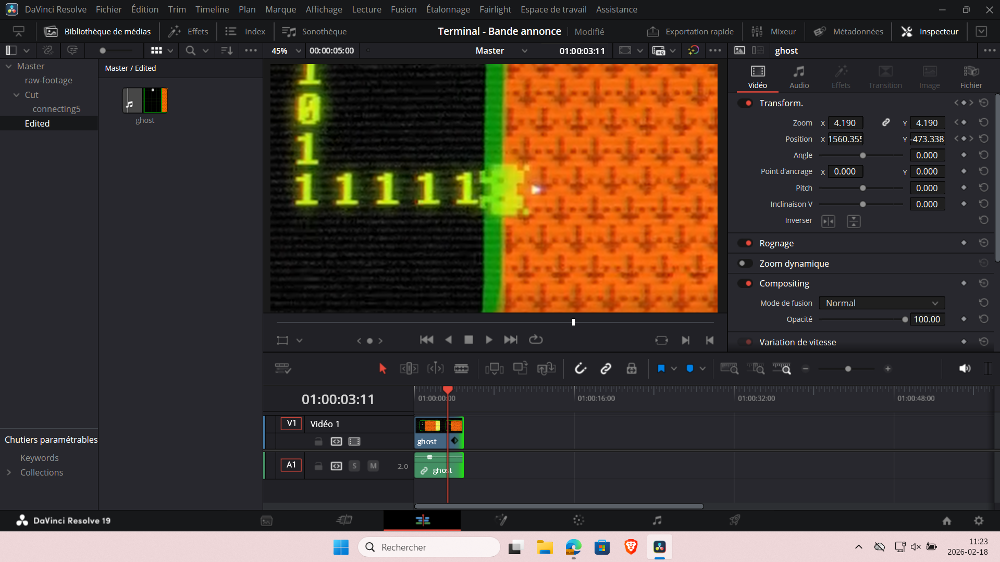
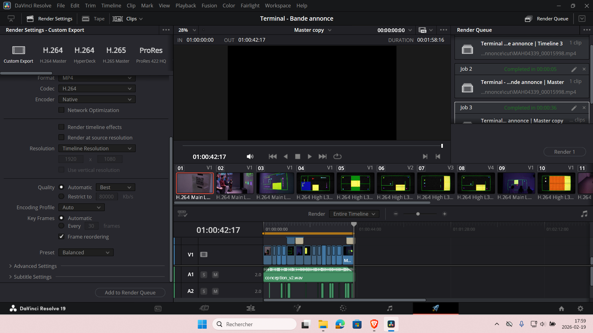
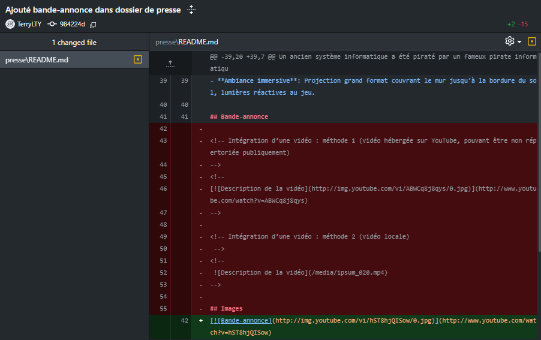

# Ting Yung Lu Terry

 <!--
À la session 6, 
- Au début de la semaine : 
    - Objectifs de la semaine
- À la fin de la semaine :
    - Explication détaillée des tâches accomplies
    - Documentation multimédia des tâches accomplies
 -->

# Planification

## Semaine 1
- Envisager et lister tous les sons du projet à produire sur un fichier Word
- Établir le projet Reaper

## Semaine 2
- Installation de haut-parleurs
- Créer l'effet sonore de la connexion d'un joueur
- Créer l'effet sonore de la déconnexion d'un joueur
- Créer l'effet sonore de victoire
- Créer l'effet sonore de l'arrivée à l'objectif (1 personne)

## Semaine 3
- Créer l'effet sonore de défaite
- Créer l'effet sonore du décompte
- Créer l'effet sonore du recommencement de l'état du jeu
- Créer le son d'ambiance des niveaux 1 – 5 (facile)

## Semaine 4
- Enregistrer la narration du cinématique au studio
- Créer l'effet sonore de la clé
- Créer l'effet sonore du projectile
- Créer le son d'ambiance des niveaux 6 – 10 (moyen)
- Créer le son d'ambiance de la cinématique d'introduction

## Semaine 5
- Travailler sur la bande d'annonce
- Création des niveaux 2 et 3 avec 6 difficultés selon le nombre de joueurs (12 scènes)
- Créer le son d'ambiance de la scène d'attente
- Créer le son d'ambiance des niveaux 11 – 15 (difficile)

## Semaine 6
- Créer l'effet sonore de la porte verrouillée
- Créer l'effet sonore de la porte laser
- Créer l'effet sonore de la sortie verrouillée
- Créer le son d'ambiance des niveaux 16 – 20 (très difficile)

## Semaine de rattrapage
- Créer l'effet sonore du ¨powerup¨ #1 (Efface ligne)
- Créer l'effet sonore du ¨powerup¨ #2 (Fantôme)
- Créer l'effet sonore du ¨powerup¨ #3 (Arrête le temps)
- Créer le son d'ambiance de la cinématique finale

## Semaine 7
- Création des niveaux 4 et 5 avec 6 difficultés selon le nombre de joueurs (12 scènes)
- Tester le projet extensivement et gérer tous les problèmes techniques en lien avec l'audio.
- Travailler sur la documentation

## Semaine 8
- Surveillance et maintenance des sons du projet durant les présentations afin de corriger rapidement tout problème éventuel

 

# Journal de bord

## Semaine 2

### Lundi
- Reporté travail pour mardi

### Mardi
- Crée l'effet sonore de connection 
[Connection](./media/connect_v1.wav)
- Crée l'effet sonore de déconnection
[Déconnection](./media/disconnect_v1.wav)
- Commencé l'effet sonore de la victoire

### Mercredi
- Finalisé l'effet sonore de la victoire
- Commencé l'effet sonore de l'arrivée à l'objectif d'un joueur 
[Victoire](./media/victory_v1.wav)

### Jeudi
- Terminé l'effet sonore de l'arrivée à l'objectif d'un joueur  
[Arrivée](./media/finish_v1.wav)

### Vendredi
- Ajout de la section esthétique et intention sonore
- Fait des variations de l'effet sonore de victoire

## Semaine 3

### Lundi
- Commencé son l'effet sonore de défaite

### Mardi
- Terminé l'effet sonore de défaite
[Défaite](./media/defeat_v1.wav)
- Crée l'effet sonore du décompte 
[Décompte](./media/countdown_beep.wav)
- Crée l'effet sonore du recommencement de l'état du jeu
[Recommencement](./media/restart_v1.wav)
- Créer le son d'ambiance des niveaux 1 – 5 (facile)
[Ambiance](./media/ambiance_jeu_1.wav)

### Mercredi
- Ajustement des sons dans le jeu
- Assisté à l'installation 

### Jeudi
- Installé la caméra dans le studio
- Participé à la porte ouverte
- Identifié des problèmes techniques et d'accessibilité

### Vendredi
- Cherché des VST pertinents
- Commencé à retravaillé les sons déjà crée

## Semaine 4

### Lundi
- Pas d'avancement, reporté le travail à mardi

### Mardi
- Organisation de la carte SD
- Coupure des videos prises sur la caméra

### Mercredi
- Refait l'effet sonore de défaite
[Defeat](./media/defeat.wav)
- Refait l'effet sonore de victoire
[Victoire](./media/victory.wav)
- Crée l'effet sonore de clés
[Clé](./media/key.wav)

### Jeudi
- Validation du design sonore
- Refait l'effet sonore de l'arrivée
[Finish](./media/finish.wav)
- Crée l'effet sonore de collision de projectiles
[Collision projectile](./media/projectile_hit_mur.wav)
- Crée des variations de l'effet sonore de défaite
[Variation Défaite](./media/defeat2.wav)

### Vendredi
- Pas d'avancement, reporté le travail à mardi

## Semaine 5

### Lundi
- Pas d'avancement, reporté le travail à mardi

### Mardi
- Ajouté des images et de l'audio de documentation au journal de bord

### Mercredi
- Commencement du montage de la bande-annonce

### Jeudi
- Tournage au grand studio pour la bande-annonce
- Avancement du montage de la bande=annonce

### Vendredi
- Finition du montage de la bande-annonce
- Intégration de la bande-annonce dans le dossier de presse

## Semaine 6

### Lundi

### Mardi

### Mercredi

### Jeudi

### Vendredi

## Semaine de rattrapge

### Lundi

### Mardi

### Mercredi

### Jeudi

### Vendredi

## Semaine 7

### Lundi

### Mardi

### Mercredi

### Jeudi

### Vendredi
