# Exposition

Cette section documente l'exposition publique du projet.

## Permanence

Ce tableau indique les responsables quotidiens de l’exposition, désignés par chaque équipe pour assurer la permanence pendant la semaine.

| Jour     | Responsable                       |
| -------- | --------------------------------- |
| Lundi    | Dana, Mégane                      |
| Mardi    | Dana, Mégane                      |
| Mercredi | Terry, Elie                       |
| Jeudi    | Émeryk                            |
| Vendredi | Dana, Mégane, Terry, Émeryk, Elie |

## Procédure d’ouveture quotidienne

Cette section décrit les étapes nécessaires pour ouvrir l’installation chaque matin.
Elle a pour objectif de garantir une mise en place cohérente, sécuritaire et fidèle au projet, quel que soit le responsable de permanence.

1. Allumer l'ordinateur et se connecter au compte d'Elie

2. Ouvrir le projet Unity

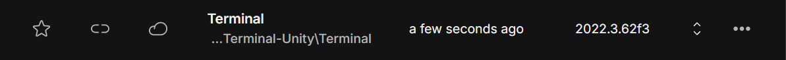

3. S'assurer de choisir la scène MainMenu en premier

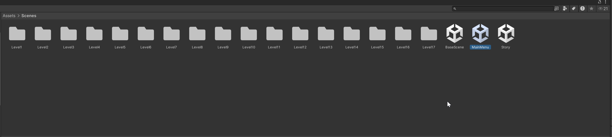

4. S'assurer que « Play Maximized » est sélectionné avant de cliquer sur play, puis après avoir cliqué sur play, mettre le « scale » à 1.6x

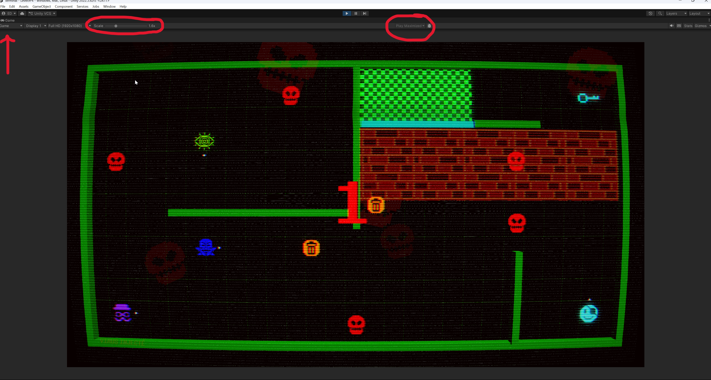

5. Ouvrir ngrok et copier-coller la commande suivante pour démarrer le serveur : ngrok http --url=terminal.ngrok-free.dev 8443

6. Si la console affiche ce qui est montré dans l'image, alors le serveur a été démarré avec succès. Si cela ne fonctionne pas, s'assurer d'avoir ouvert CMD et non PowerShell.

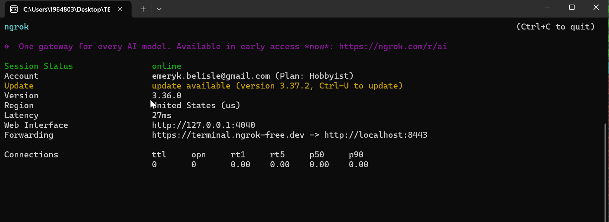

7. Ouvrir l'application Gdpjlink et s'assurer d'allumer les deux projecteurs pour 192.168.8.1.21 et 192.168.8.1.61

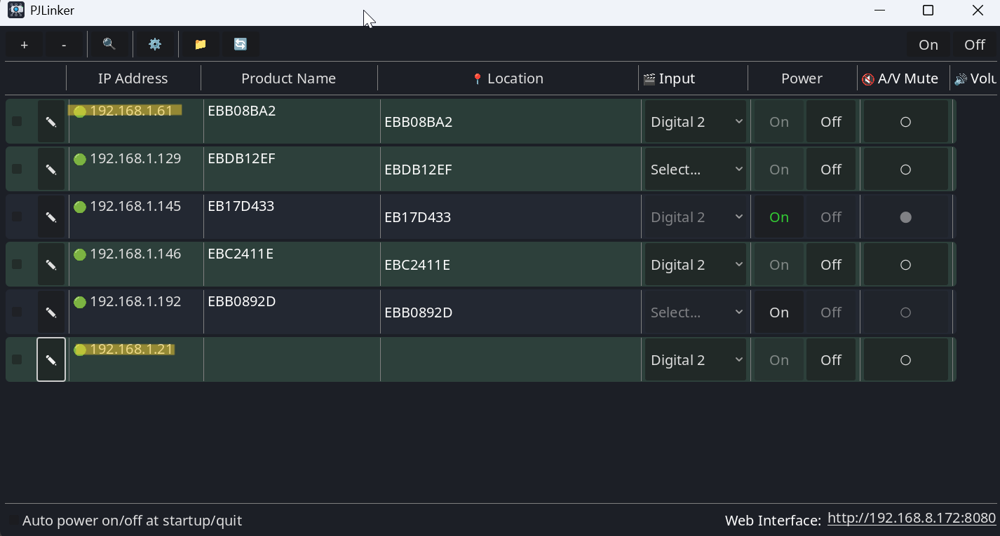

8. Ouvrir OBS et s'assurer que la scène « ProjJeu » est sur le projecteur 1920x1080 ainsi que « projBackground » sur le projecteur 1280x800

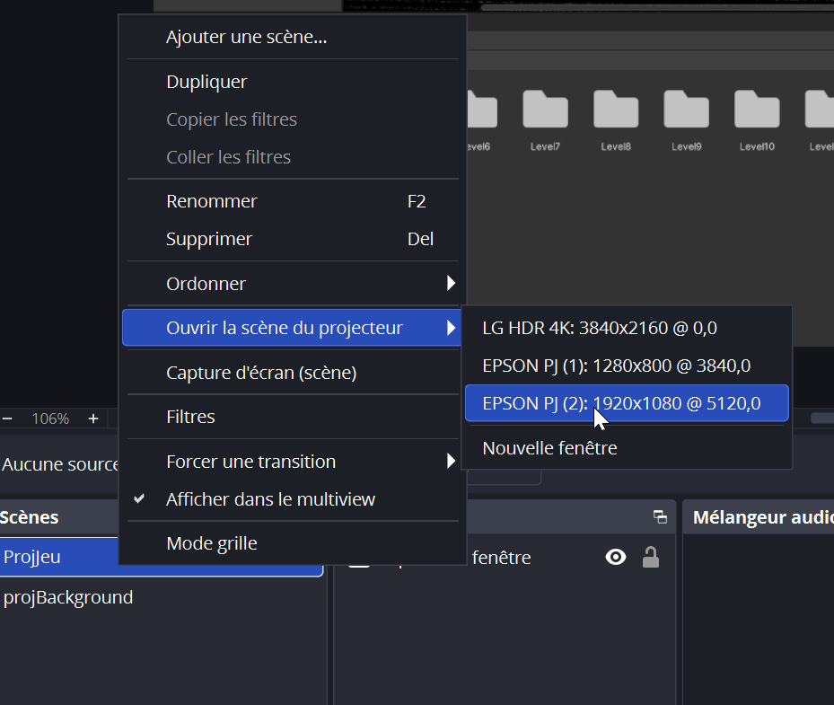

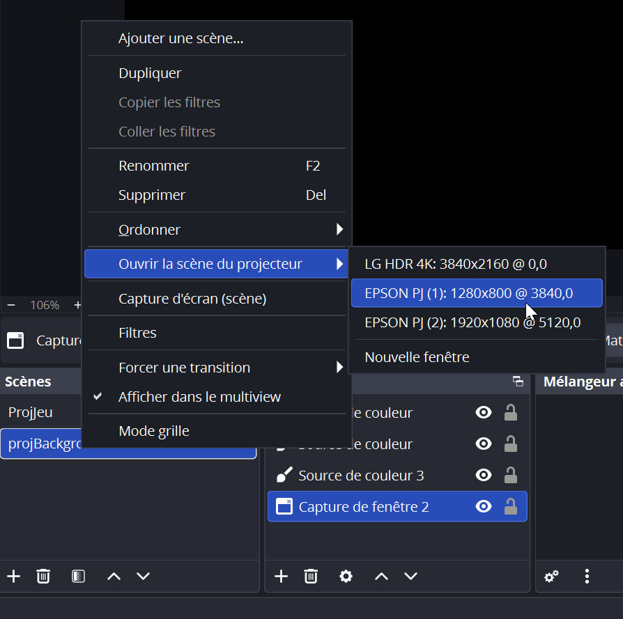

9. S'assurer d'ouvrir HyperHDR et qu'il se trouve dans la zone de notification de la barre des tâches

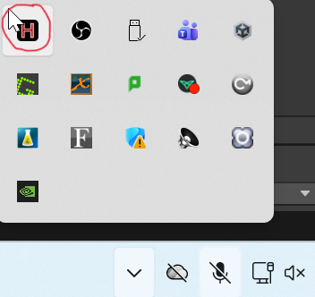

10. Aller à C:\Users\1964803\Documents\GitHub\Terminal-Unity\Background et ouvrir le site web du fond d'écran dans Visual Studio Code, puis cliquer sur « Go Live ».

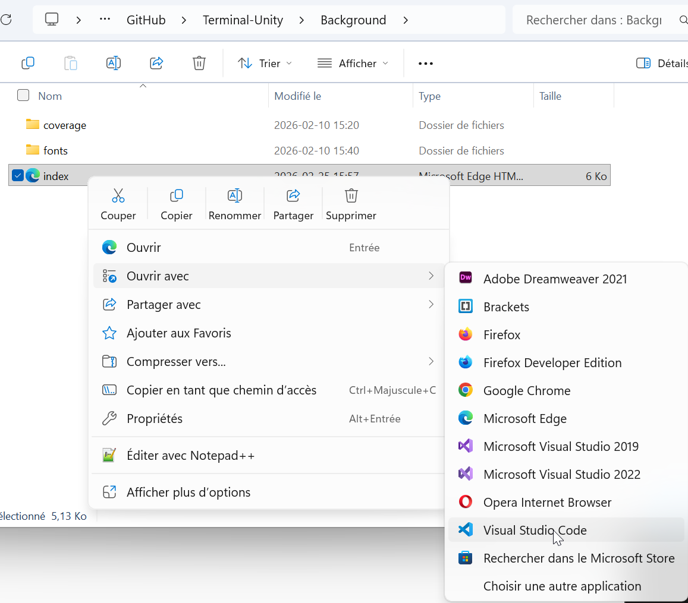

11. S'assurer de mettre la page web en plein écran, puis aller sur OBS et vérifier que « projBackground » est bien configuré

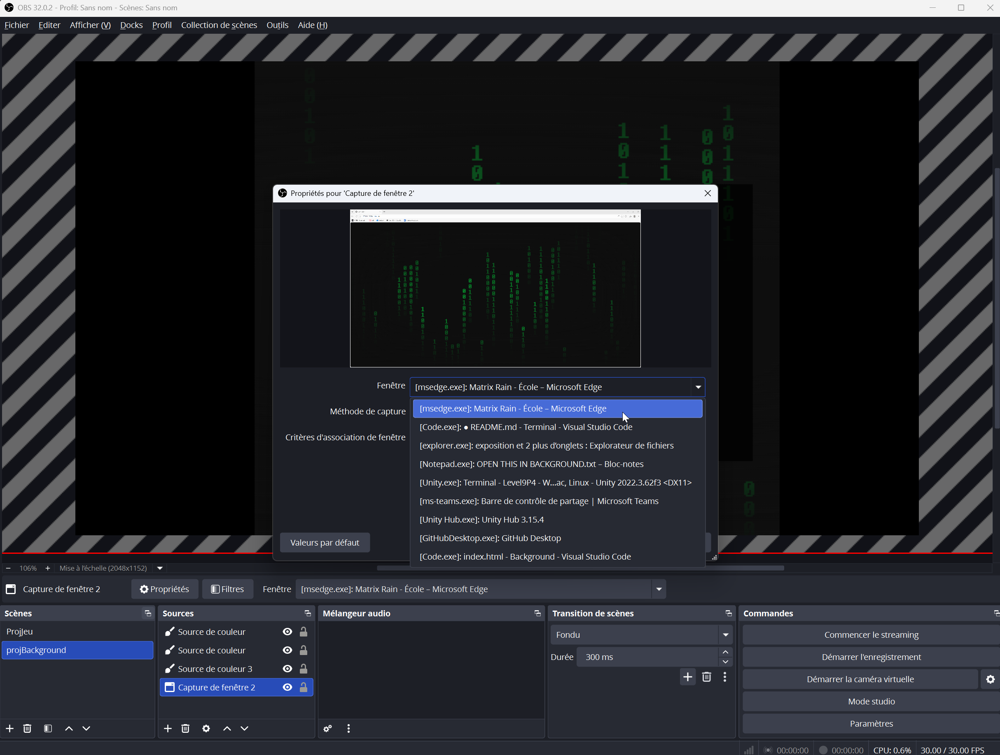

12. S'assurer de cliquer une fois sur le site web pour le mettre au focus, puis cliquer sur OBS

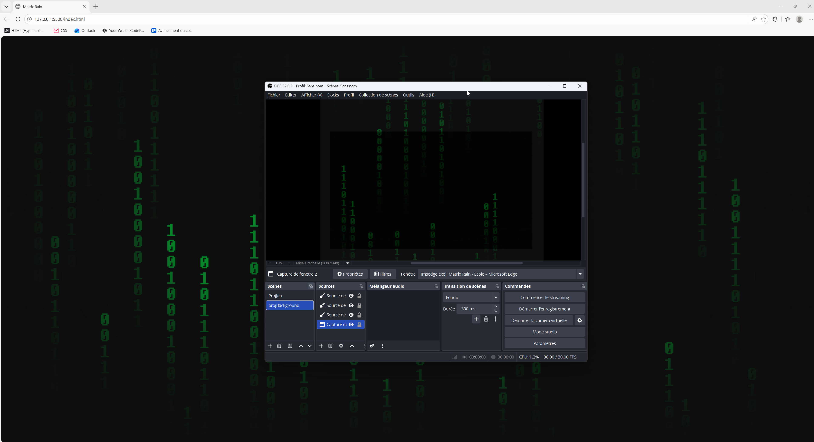

13. En cas de problèmes de connectivité du routeur (les joueurs ne peuvent pas se connecter au jeu s'ils n'ont pas de LTE/Wi-Fi et doivent se connecter au Wi-Fi de notre routeur) : Débrancher le câble Ethernet du routeur > aller sur le site d'administration du routeur (192.168.8.1) et cliquer sur redémarrer.

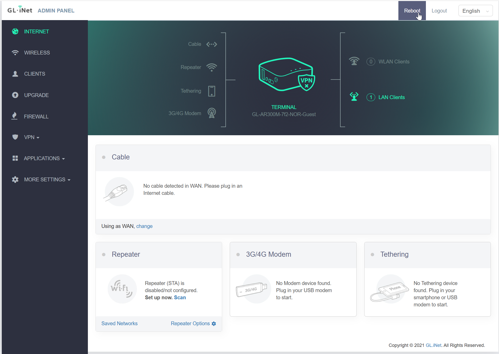

14. En cas de bogue du jeu nécessitant une réinitialisation : Arrêter le jeu puis cliquer sur play à nouveau

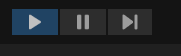

15. En cas de dysfonctionnement des lumières, aller à http://pi-lx.local/ , puis NOVNC, et s'assurer que Universe 3 a « Passthrough » coché et que l'adresse IP de l'Art-Net (192.168.1.16) a les options entrée et sortie cochées

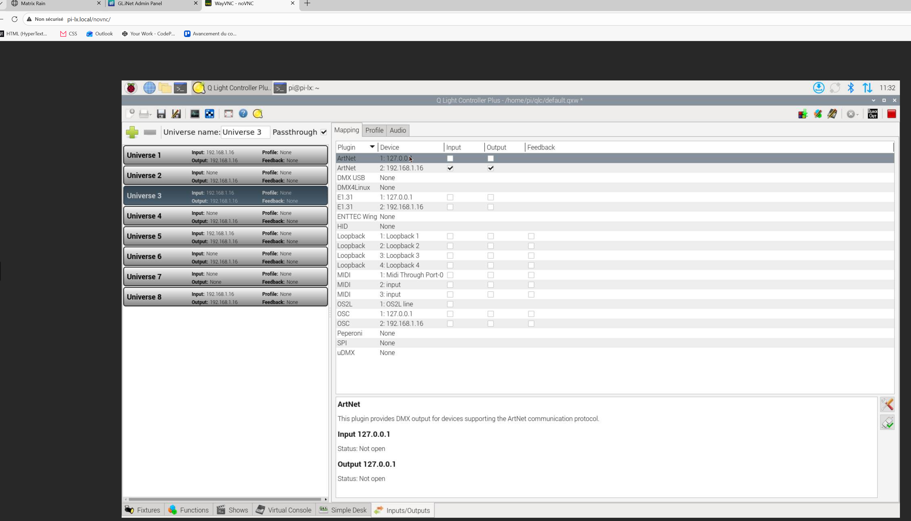

<!--
Chaque composante de l’installation est détaillée ci-dessous avec :
- une description,
- les étapes d'ouverture
- des liens utiles,
- des photos de référence.
-->

## Documentation vidéo finale

